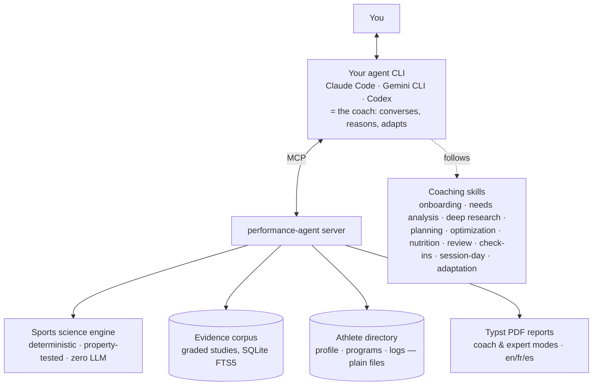

# PerformanceAgent

🏋️ **The first open-source AI Strength & Conditioning Coach powered by scientific research.**

**English** · [Français](docs/i18n/README.fr.md) · [Español](docs/i18n/README.es.md) · [Deutsch](docs/i18n/README.de.md) · [Italiano](docs/i18n/README.it.md)


It runs inside an AI agent CLI — a terminal program you chat with, such as Claude Code,
Gemini CLI, or Codex — and turns it into a professional coach that designs, explains,
monitors, and adapts your training. No backend, no API key, no hosting, no extra
subscription. And it will tell you the truth when your goal is unrealistic:

```text
$ claude
> I run 10K in 55:00. I want 35:00 in 12 weeks.

🏋️ Coach: I evaluated your goal with the feasibility engine:

   Probability: 0.2% — I have to be honest, this is unrealistic.
   You're asking for a 36% improvement — about 3%/week sustained
   for 12 weeks. Beginners sustain roughly 1%/week.

   Counter-proposal: 46:30 in 12 weeks (~78% probability),
   then we reassess. Want me to build that program?
```

## Why another AI fitness coach? Because this one can't lie to you

LLM fitness coaches have two failure modes: they invent scientific references, and they
tell you what you want to hear. PerformanceAgent is architected so neither is possible:

- **LLMs narrate, the engine calculates.** Every number — feasibility probabilities,
  race predictions, training loads, periodization waves — comes from a deterministic,
  property-tested Python engine. The agent explains the math; it never does the math.
- **Citations can't be hallucinated.** The coach may only cite studies returned by the
  local evidence corpus (graded, DOI/PMID-verified). The PDF renderer hard-fails on any
  reference that isn't in the corpus.
- **Your data is files, not a cloud.** Profile, programs, session logs, and check-ins
  live in a plain directory of markdown/YAML you can read, edit, diff, and sync.
- **Any sport, not a lookup table.** The coach researches what determines performance
  in *your* event and fills a structured, versioned model — trainable qualities,
  benchmarks, injury risks — then computes your gaps against it. A kayak sprinter is
  modeled exactly like a powerlifter; no sport is hard-coded. Exercise choice is a
  deterministic scored ranking (not authored from memory), and the individualization
  is *fitted*: your own fitness-fatigue time constants, taper response and per-quality
  rates — with honesty gates that refuse a number when the data is too thin — planned
  across a 1-4 year macrocycle.
- **Athlete document drop folder** — drop studies, physio reports or past
  programs into `documentation/`; verified studies join the evidence corpus
  (full text read), everything else informs coaching as context, never faked
  as science.
- **Research that stays alive** — targeted mini-waves on plateaus, injuries and
  athlete questions; an incremental literature watch at every mesocycle
  boundary (`year_from` delta queries), all folded into the versioned dossier.
- **Weekly loads review** — structured per-block progression rules computed by
  the engine (`suggest_next_week_loads`): next week's exact weights from this
  week's logs, flags instead of guesses.
- **Program watch** — a biweekly per-exercise audit (keep / watch / substitute
  candidate) written as a versioned report; substitutions go through
  program-adaptation, never silently.
- **Science on the gym page** — the offline program HTML opens with sourced
  advice and "why this program" lines, `[n]` markers on blocks, and a starred
  bibliography.
- **Pre-competition protocol** — the final days before any competition planned
  day by day (engine-computed attempts, pacing splits and carb loading; risky
  peak-week practices described only with evidence grade + explicit warning),
  delivered as a versioned document and an offline phone page for the event.

## Install once — then it's one folder per athlete

PerformanceAgent isn't an app you open — it plugs into an AI agent CLI. You set it up
**once** (below), and from then on coaching someone is three moves:

```bash
mkdir -p ~/coaching/marie && cd ~/coaching/marie && claude
```

**Make a folder, `cd` into it, launch `claude` — and you're coaching.** That folder
*is* the athlete: profile, programs, session logs and check-ins all live inside it as
plain files you can read, edit, diff and back up. Nothing is sent anywhere. Coaching
several athletes is just several folders — `cd` into the right one and the coach picks
up where you left off. Then you talk to it in plain language; no config files, no
commands to memorize.

### One-time setup (Claude Code — 2 commands)

**Never used Claude Code before?** Install it first:

```bash
curl -fsSL https://claude.ai/install.sh | bash
```

(full instructions: [code.claude.com/docs](https://code.claude.com/docs/en/quickstart.md)).
You'll also need [`uv`](https://docs.astral.sh/uv/getting-started/installation/) — it
fetches the right Python version by itself, nothing else to install.

**Install the plugin.** From inside Claude Code, run these two commands once:

```
/plugin marketplace add clementrx/Performance-agent
/plugin install performance-agent@performance-agent
```

One install gives you both halves of the coach: the *tools* (the engine, the science
library, your future athlete profile) as an MCP server, **and** the *coaching protocols*
— the 16 skills that tell Claude when to ask what, when to be honest about a goal, how
to build a program. The MCP server registers at user scope, so it's available from
every folder you later launch `claude` in — which is what makes one-folder-per-athlete
work. Claude Code keeps the plugin up to date (`/plugin marketplace update performance-agent`).

**Fully quit and restart Claude Code.** New tools and skills load only when a `claude`
session *starts*: close any open session completely and run `claude` again.

**Check it worked** — open an athlete folder and ask:

```
> List the performance-agent tools.
```

You should see 103 tools. If so, you're done — make a folder and start coaching.

> **Not on Claude Code?** Cursor, Claude Desktop and other MCP hosts have no plugin
> format. Register the server manually with `claude mcp add performance-agent -s user --
> uvx performance-agent` (or the equivalent JSON in your host's MCP config), then copy
> the coaching skills into your host's instructions. Full per-client steps:
> [docs/installing.md](docs/installing.md).

> **On a host that can't pick the launch folder?** Claude Desktop and a few other MCP
> hosts always start from the same place. There, set `PERFORMANCE_AGENT_HOME` to the
> athlete's folder in the server config instead of `cd`-ing into it.

## How to use it, step by step

1. **`cd` into the athlete's folder and start your agent** (`claude`) — an empty
   folder for a new athlete, an existing one to pick up their history.
2. **Say your goal in plain language** — any language works. *"I want to run a 10K
   under 50 minutes"*, *"Prépare-moi pour un Hyrox"*.
3. **Answer the coach's questions.** First time, it runs a short onboarding (current
   level, history, schedule, equipment) and saves your profile.
4. **Get an honest verdict.** The feasibility engine scores your goal; if it's out of
   reach, you get the real probability and a counter-proposal.
5. **Say yes** — the program is written to `programs/program-20260712.md`, periodized
   into cycles with deloads and taper, every prescription carrying its purpose,
   evidence grade (★★★★★ → ★☆☆☆☆), and verified citations. Next to it,
   `program-20260712.html` is a standalone session page for the gym: every strength
   exercise with its animation GIF, step-by-step technique in your language,
   sets, reps, load, and rest — fully offline, send it to your phone. (Media
   from [exercises-dataset](https://github.com/hasaneyldrm/exercises-dataset),
   cloned automatically in the background at server start.)
6. **After each workout, log it in one line** — *"Logged: 8 km easy, RPE 4"*.
7. **Every couple of weeks, say "Check-in"** — the coach compares plan vs. reality,
   quotes your training load, and flags drift.
8. **When life happens** — *"I tweaked my ankle"*, *"I can only train twice next
   week"* — the program is adapted and versioned (nouveau fichier daté) with the reason
   recorded in the audit trail.

## Three real examples

Feasibility numbers below come from the deterministic engine — run it yourself and
you'll get the same ones. Want to see the resulting program files? Each of these
three conversations ends with a full program — browse them in
[`examples/`](examples/), in all five languages.

### 1. Run a 10K under 50 minutes

```text
> I want to run a 10K under 50 minutes. I have 5 months. Coach me.

🏋️ Coach: Two facts before I judge that goal: your current 10K time,
   and how long you've been training consistently?

> I ran 55:12 last month. About a year of running, 3× a week.

🏋️ Coach: Feasibility over your 21-week horizon:

   Probability: 84% — realistic, and worth committing to.
   You need a 9.5% improvement, i.e. 0.45%/week, while a runner at
   your training age can sustain about 1%/week. Comfortable margin.

   Want me to build the program?

> Yes.

📄 Program written to programs/program-20260712.md
   21 weeks, 3 runs/week: one interval session, one tempo, one long
   run — periodized with deloads and a 10-day taper.
```

### 2. Prepare a Hyrox in 3 months

```text
> I signed up for a Hyrox in 3 months. Build me a plan.

🏋️ Coach: Hyrox is 8 km of running broken up by 8 strength stations —
   so we train both, together. Three facts: your 10K time (or best
   guess), your strength background, and days per week you can train?

> 10K around 52 min, I lift twice a week, I can do 4 sessions.

🏋️ Coach: Good base for a strong first finish. Honest note: 12 weeks
   is enough to finish well and enjoy it; chasing a podium time would
   need a longer runway — I'd rather tell you now.

   Plan on 4 days: one running-interval day, one station-strength day
   (sled work, lunges, wall balls), one "compromised running" brick
   (run → station → run, the skill Hyrox actually tests), one easy
   long run. Deloads weeks 4 and 8, race-week taper. Build it?

> Yes.

📄 Program written to programs/program-20260712.md
```

### 3. Visible abs and bigger arms in 3 months

```text
> I want visible abs and bigger arms in 3 months.

🏋️ Coach: Those are two different physiological goals — arms grow
   with volume and enough calories; abs show at low body fat, which
   usually means a deficit. Before I promise anything: height, weight,
   training experience, and sessions per week?

> 1.78 m, 82 kg, two years of lifting, 4 sessions a week.

🏋️ Coach: Honest verdict: in 12 weeks you can make real progress on
   both, but not maximize both — recomposition is slow at two years
   of training. The realistic version:

   - Moderate calorie deficit with a high protein target (the
     Nutritionist skill quantifies it, with safety guards).
   - Upper-body priority: 12–16 hard sets/week for arms, heavy
     compound work kept in to protect strength in the deficit.
   - 3 lifting days + 1 conditioning day.
   - Expected at week 12: visibly fuller arms, abs "outlined" if
     you start around 15–18% body fat; leaner than that takes longer,
     and I'll say so at every check-in rather than let you guess.

   Want the program?

> Yes.

📄 Program written to programs/program-20260712.md
```

## Which AI tool can I use this with?

The **MCP server** (engine, science, data) speaks a standard protocol —
[MCP](https://modelcontextprotocol.io) — that most AI coding tools understand. The
**coaching skills** are packaged in Claude Code's native skill format; elsewhere you
paste the same instructions into that tool's own "custom instructions" file.

| Client | MCP tools | Coaching skills |
|---|---|---|
| Claude Code | ✅ native (steps above) | ✅ native |
| Gemini CLI | ✅ native | ⚠️ paste into `GEMINI.md` |
| Codex | ✅ native | ⚠️ paste into `AGENTS.md` |
| Cursor | ✅ native | ⚠️ paste into `.cursor/rules/*.mdc` |
| Windsurf | ✅ native | ⚠️ paste into its rules/memories settings |
| VS Code (GitHub Copilot) | ✅ native | ⚠️ paste into `.github/copilot-instructions.md` |
| Cline (VS Code extension) | ✅ native | ⚠️ paste into `.clinerules/` |

Setup commands for each, PDF reports (requires `typst`), data-directory resolution,
and troubleshooting: [docs/installing.md](docs/installing.md). Any other tool that
supports MCP servers works with the same `uvx performance-agent` command.

## How it works

Just here to use the coach? Skip this — it's for the curious and for contributors.



The skills encode professional coaching protocols (what to ask, when to be honest, how
to periodize, when to deload). The MCP tools own every fact. The agent you already use
glues it together with your existing subscription — **zero additional LLM cost**.

**Working today:** deterministic engine (1RM estimation, Riegel race prediction,
session-RPE load & ACWR, monotony/strain, fitness-fatigue CTL/ATL/TSB, readiness
banding, external-load budgeting, goal feasibility, periodization waves, backward
season planning from a dated calendar, day-of session autoregulation
(readiness-based adjustment, time compression, exercise substitution),
intra-week sequencing & interference guard (heavy-pattern spacing, HIIT-before-lower
interference, consecutive-high-day and match-window rules), individualized
recalibration from the athlete's own logs (measured progression rate honest about n,
prescribed-vs-actual compliance, volume-tolerance association, a versioned response
profile) that recomputes goal feasibility against the measured rate, data-driven
deload recommendations (monotony/strain, TSB and readiness trends against the planned
counter) and a graded return-to-load ramp after time off (clearance-gated),
proactive follow-up that surfaces what is due (overdue check-in, imminent race,
missed sessions, readiness gaps, a stale response profile) severity-ordered so the
coach speaks first, and a deterministic end-to-end simulation (no LLM) that drives
the real engine + store across synthetic athletes — including an UNSEEDED sport
(kayak sprint) whose hand-authored model flows through the whole pipeline exactly
like a seeded one, proving the machine is sport-independent — to prove the whole
loop composes, a sport-agnostic PerformanceModel (the researched, versioned answer to
"what determines performance in this event" — trainable qualities with normalized
weights, KPIs with level benchmarks, injury risks and energy-system split, every
value provenance-labeled cited/prior/judgment) that drives gap analysis (measured
KPIs vs benchmarks, per-quality training priorities, unmeasured stays unmeasured)
and a dated test battery scheduled as experiments around the calendar, seeded with
four reference models (sprint, 10k, powerlifting, football) that are examples not a
support gate, and a structured exercise ontology (~120 seed exercises attributed by
movement pattern, force vector, contraction regime, kinetic chain, equipment,
specificity level and qualities trained — filterable, and extensible with the
athlete's own additions) with deterministic scored exercise selection (quality
match × phase-appropriate specificity × equipment feasibility × contraindication
hard-gate × novelty, ranked with a per-attribute justification), stimulus-equivalence
substitution and a mesocycle specificity-mix guard, plus optional high-resolution
data ingestion (velocity-based-training CSV imports as structured sets, .fit/.tcx
rides yield power/normalized-power/cadence/lap-splits, and jump/sprint measurements
land in the KPI log — every high-res input optional, missing data lowers stated
resolution rather than blocking), load-velocity profiling (a fitted per-exercise
velocity-load line with an estimated 1RM, gated honestly and refused when the loads
are too few or too narrow) that feeds day-of velocity-based load suggestions
(bounded, labeled, never auto-applied), and a fitted per-athlete two-component
Banister impulse-response model (deterministic pure-Python grid fit of the
fitness/fatigue time constants and gains, gated honestly — refused without ≥8 weeks
of load and ≥5 spanning performance points, or when pinned/implausible — feeding the
athlete's own time constants into the fitness-fatigue trend), individual taper
response (detects past tapers from the load log, pairs each with its event-linked
outcome, and recommends duration/reduction from the athlete's own best-outcome taper
when ≥2 exist — else the labeled population rule) and per-quality progression rates
keyed through the model KPIs, plus multi-year macrocycle planning (a 1-4 year plan
typed backward from the major event with per-year quality-emphasis budgets derived
from the gap priorities, feeding the season) and a training-residuals guard (warns
where a maintained quality would decay past its Issurin retention window without a
refresh);
1425 tests
incl. property-based) · 103 MCP
tools · file-based athlete memory with a season calendar, pre-session readiness
logs, versioned machine-readable programs (structured plan + rendered markdown),
a day-of adjustment log with escalation signals, a versioned individual response
profile, versioned performance models, a dated KPI-results log, and an adaptation
audit trail ·
activity-file import (.fit/.tcx/.gpx/CSV, incl. power/cadence/splits and VBT
exports) that proposes a session for the athlete to confirm before logging —
or pulled straight from Garmin/Strava when their MCP server is connected ·
device recovery trends read deterministically (rolling ln-rMSSD vs a 28-day
baseline ± the smallest worthwhile change, resting-HR and sleep-debt trends,
honesty-gated) by a dedicated recovery-analyst skill ·
DOI/PMID/ISBN-verified evidence corpus with anti-fabrication
citation checks · live evidence search (PubMed, OpenAlex, Crossref, Semantic Scholar)
behind a double verification gate · sixteen coaching skills incl. a mandatory delivery
gate with an adversarial second opinion · Typst PDF reports (en/fr/es) behind a hard
citation gate.

**Roadmap:** environment & fine peaking (altitude/hypoxia, heat acclimatization,
jet-lag protocols, competition-hour scheduling) — the deliberate next iteration ·
corpus growth toward ~200 studies · outcome simulation (Monte Carlo on the fitted
Banister model) · optional web front-end reusing the same MCP server.

## Design principles

- **Evidence first** — systematic reviews → meta-analyses → RCTs → cohorts → expert
  opinion; every recommendation shows its grade, and thin evidence is labeled as such.
- **Honest by construction** — unrealistic goals get honest probabilities with the
  drivers behind them; contested metrics carry their caveats.
- **Agent-native** — your CLI agent is the interface; your subscription is the compute;
  your filesystem is the database.
- **Long-term athlete memory** — no conversation starts from zero.

## For developers

The engine is a pure Python package you can use directly:

```python
from performance_agent.engine import TrainingAge, endurance_feasibility

verdict = endurance_feasibility(
    current_time_s=3300, target_time_s=2100, weeks=12, training_age=TrainingAge.BEGINNER
)
verdict.probability  # 0.0023 — with improvement_needed, required and achievable rates
```

Repository layout: `src/performance_agent` (engine, evidence, memory, reports, MCP
server) · `skills/` (coaching protocols) · `docs/` (install & usage) ·
`examples/` (full sample conversations in five languages).

## Contributing

Early development, moving fast — see [CONTRIBUTING.md](CONTRIBUTING.md) for the dev
setup and review conventions. Sports scientists and S&C coaches: the evidence-grading
pipeline will need expert reviewers — watch this space.

## License

Apache-2.0 — see [LICENSE](LICENSE).
