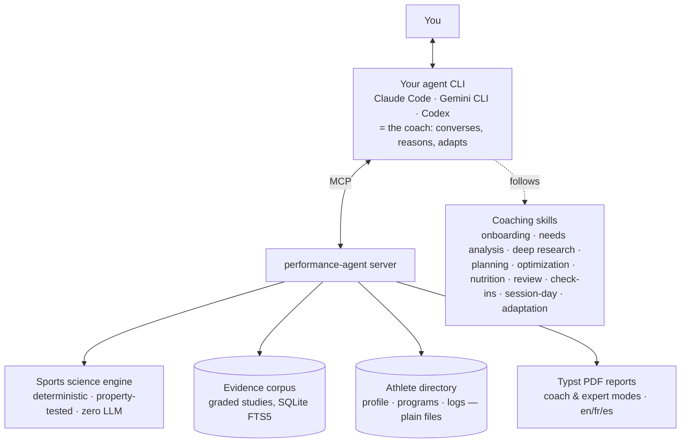

# PerformanceAgent

🏋️ **The first open-source AI Strength & Conditioning Coach powered by scientific research.**

**English** · [Français](docs/i18n/README.fr.md) · [Español](docs/i18n/README.es.md) · [Deutsch](docs/i18n/README.de.md) · [Italiano](docs/i18n/README.it.md)


It runs inside an AI agent CLI — a terminal program you chat with, such as Claude Code,
Gemini CLI, or Codex — and turns it into a professional coach that designs, explains,
monitors, and adapts your training. No backend, no API key, no hosting, no extra
subscription. And it will tell you the truth when your goal is unrealistic:

```text
$ claude
> I run 10K in 55:00. I want 35:00 in 12 weeks.

🏋️ Coach: I evaluated your goal with the feasibility engine:

   Probability: 0.2% — I have to be honest, this is unrealistic.
   You're asking for a 36% improvement — about 3%/week sustained
   for 12 weeks. Beginners sustain roughly 1%/week.

   Counter-proposal: 46:30 in 12 weeks (~78% probability),
   then we reassess. Want me to build that program?
```

## Why another AI fitness coach? Because this one can't lie to you

LLM fitness coaches have two failure modes: they invent scientific references, and they
tell you what you want to hear. PerformanceAgent is architected so neither is possible:

- **LLMs narrate, the engine calculates.** Every number — feasibility probabilities,
  race predictions, training loads, periodization waves — comes from a deterministic,
  property-tested Python engine. The agent explains the math; it never does the math.
- **Citations can't be hallucinated.** The coach may only cite studies returned by the
  local evidence corpus (graded, DOI/PMID-verified). The PDF renderer hard-fails on any
  reference that isn't in the corpus.
- **Your data is files, not a cloud.** Profile, programs, session logs, and check-ins
  live in a plain directory of markdown/YAML you can read, edit, diff, and sync.

## Install (5 minutes, 3 steps)

PerformanceAgent isn't an app you open — it plugs into an AI agent CLI. Once plugged
in, you just talk to it in plain language; no config files, no commands to memorize.

**Never used Claude Code before?** Install it first:

```bash
curl -fsSL https://claude.ai/install.sh | bash
```

(full instructions: [code.claude.com/docs](https://code.claude.com/docs/en/quickstart.md)).
You'll also need [`uv`](https://docs.astral.sh/uv/getting-started/installation/) — it
fetches the right Python version by itself, nothing else to install.

**Step 1 — plug in the coach.** Run this once, from any terminal:

```bash
claude mcp add performance-agent -s user \
  --env PERFORMANCE_AGENT_HOME=~/athlete-data -- uvx performance-agent
```

This registers the coach's "brain" (the engine, the science library, your future
athlete profile) as a tool Claude Code can call. `-s user` makes it available in any
folder you later open `claude` from. `~/athlete-data` is just a suggested path — pick
any folder, it doesn't need to exist yet: the coach creates it the first time it saves
something. That's where all your data lives as plain files; nothing is sent anywhere.

**Step 2 — teach it how to coach.** Step 1 gave Claude the *tools* (the math, the
data). This step gives it the *coaching protocols* — when to ask what, when to be
honest about a goal, how to build a program:

```bash
git clone --depth 1 https://github.com/clementrx/Performance-agent
mkdir -p ~/.claude/skills
cp -R Performance-agent/skills/* ~/.claude/skills/
```

**Step 3 — fully quit and restart Claude Code.** New tools load only when a `claude`
session *starts*: close any open session completely and run `claude` again.

**Check it worked** — in the fresh session, ask:

```
> List the performance-agent tools.
```

You should see 75 tools. If so, you're done — just talk to it.

## How to use it, step by step

1. **Open a terminal and start your agent** (`claude`).
2. **Say your goal in plain language** — any language works. *"I want to run a 10K
   under 50 minutes"*, *"Prépare-moi pour un Hyrox"*.
3. **Answer the coach's questions.** First time, it runs a short onboarding (current
   level, history, schedule, equipment) and saves your profile.
4. **Get an honest verdict.** The feasibility engine scores your goal; if it's out of
   reach, you get the real probability and a counter-proposal.
5. **Say yes** — the program is written to `athlete/programs/program-v1.md`, periodized
   into cycles with deloads and taper, every prescription carrying its purpose,
   evidence grade (★★★★★ → ★☆☆☆☆), and verified citations.
6. **After each workout, log it in one line** — *"Logged: 8 km easy, RPE 4"*.
7. **Every couple of weeks, say "Check-in"** — the coach compares plan vs. reality,
   quotes your training load, and flags drift.
8. **When life happens** — *"I tweaked my ankle"*, *"I can only train twice next
   week"* — the program is adapted and versioned (`program-v2.md`) with the reason
   recorded in the audit trail.

## Three real examples

Feasibility numbers below come from the deterministic engine — run it yourself and
you'll get the same ones. Want to see the resulting program files? Each of these
three conversations ends with a full program — browse them in
[`examples/`](examples/), in all five languages.

### 1. Run a 10K under 50 minutes

```text
> I want to run a 10K under 50 minutes. I have 5 months. Coach me.

🏋️ Coach: Two facts before I judge that goal: your current 10K time,
   and how long you've been training consistently?

> I ran 55:12 last month. About a year of running, 3× a week.

🏋️ Coach: Feasibility over your 21-week horizon:

   Probability: 84% — realistic, and worth committing to.
   You need a 9.5% improvement, i.e. 0.45%/week, while a runner at
   your training age can sustain about 1%/week. Comfortable margin.

   Want me to build the program?

> Yes.

📄 Program written to athlete/programs/program-v1.md
   21 weeks, 3 runs/week: one interval session, one tempo, one long
   run — periodized with deloads and a 10-day taper.
```

### 2. Prepare a Hyrox in 3 months

```text
> I signed up for a Hyrox in 3 months. Build me a plan.

🏋️ Coach: Hyrox is 8 km of running broken up by 8 strength stations —
   so we train both, together. Three facts: your 10K time (or best
   guess), your strength background, and days per week you can train?

> 10K around 52 min, I lift twice a week, I can do 4 sessions.

🏋️ Coach: Good base for a strong first finish. Honest note: 12 weeks
   is enough to finish well and enjoy it; chasing a podium time would
   need a longer runway — I'd rather tell you now.

   Plan on 4 days: one running-interval day, one station-strength day
   (sled work, lunges, wall balls), one "compromised running" brick
   (run → station → run, the skill Hyrox actually tests), one easy
   long run. Deloads weeks 4 and 8, race-week taper. Build it?

> Yes.

📄 Program written to athlete/programs/program-v1.md
```

### 3. Visible abs and bigger arms in 3 months

```text
> I want visible abs and bigger arms in 3 months.

🏋️ Coach: Those are two different physiological goals — arms grow
   with volume and enough calories; abs show at low body fat, which
   usually means a deficit. Before I promise anything: height, weight,
   training experience, and sessions per week?

> 1.78 m, 82 kg, two years of lifting, 4 sessions a week.

🏋️ Coach: Honest verdict: in 12 weeks you can make real progress on
   both, but not maximize both — recomposition is slow at two years
   of training. The realistic version:

   - Moderate calorie deficit with a high protein target (the
     Nutritionist skill quantifies it, with safety guards).
   - Upper-body priority: 12–16 hard sets/week for arms, heavy
     compound work kept in to protect strength in the deficit.
   - 3 lifting days + 1 conditioning day.
   - Expected at week 12: visibly fuller arms, abs "outlined" if
     you start around 15–18% body fat; leaner than that takes longer,
     and I'll say so at every check-in rather than let you guess.

   Want the program?

> Yes.

📄 Program written to athlete/programs/program-v1.md
```

## Which AI tool can I use this with?

The **MCP server** (engine, science, data) speaks a standard protocol —
[MCP](https://modelcontextprotocol.io) — that most AI coding tools understand. The
**coaching skills** are packaged in Claude Code's native skill format; elsewhere you
paste the same instructions into that tool's own "custom instructions" file.

| Client | MCP tools | Coaching skills |
|---|---|---|
| Claude Code | ✅ native (steps above) | ✅ native |
| Gemini CLI | ✅ native | ⚠️ paste into `GEMINI.md` |
| Codex | ✅ native | ⚠️ paste into `AGENTS.md` |
| Cursor | ✅ native | ⚠️ paste into `.cursor/rules/*.mdc` |
| Windsurf | ✅ native | ⚠️ paste into its rules/memories settings |
| VS Code (GitHub Copilot) | ✅ native | ⚠️ paste into `.github/copilot-instructions.md` |
| Cline (VS Code extension) | ✅ native | ⚠️ paste into `.clinerules/` |

Setup commands for each, PDF reports (requires `typst`), data-directory resolution,
and troubleshooting: [docs/installing.md](docs/installing.md). Any other tool that
supports MCP servers works with the same `uvx performance-agent` command.

## How it works

Just here to use the coach? Skip this — it's for the curious and for contributors.



The skills encode professional coaching protocols (what to ask, when to be honest, how
to periodize, when to deload). The MCP tools own every fact. The agent you already use
glues it together with your existing subscription — **zero additional LLM cost**.

**Working today:** deterministic engine (1RM estimation, Riegel race prediction,
session-RPE load & ACWR, monotony/strain, fitness-fatigue CTL/ATL/TSB, readiness
banding, external-load budgeting, goal feasibility, periodization waves, backward
season planning from a dated calendar, day-of session autoregulation
(readiness-based adjustment, time compression, exercise substitution),
intra-week sequencing & interference guard (heavy-pattern spacing, HIIT-before-lower
interference, consecutive-high-day and match-window rules), individualized
recalibration from the athlete's own logs (measured progression rate honest about n,
prescribed-vs-actual compliance, volume-tolerance association, a versioned response
profile) that recomputes goal feasibility against the measured rate, data-driven
deload recommendations (monotony/strain, TSB and readiness trends against the planned
counter) and a graded return-to-load ramp after time off (clearance-gated); 957 tests
incl. property-based) · 75 MCP
tools · file-based athlete memory with a season calendar, pre-session readiness
logs, versioned machine-readable programs (structured plan + rendered markdown),
a day-of adjustment log with escalation signals, a versioned individual response
profile, and an adaptation audit trail ·
activity-file import (.fit/.tcx/.gpx/CSV) that
proposes a session for the athlete to confirm before logging ·
DOI/PMID/ISBN-verified evidence corpus with anti-fabrication
citation checks · live evidence search (PubMed, OpenAlex, Crossref, Semantic Scholar)
behind a double verification gate · twelve coaching skills incl. a mandatory delivery
gate with an adversarial second opinion · Typst PDF reports (en/fr/es) behind a hard
citation gate.

**Roadmap:** corpus growth toward ~200 studies · outcome simulation (Banister +
Monte Carlo) · more sports verticals (Hyrox-specific engine tools, football, tennis) ·
optional web front-end reusing the same MCP server.

## Design principles

- **Evidence first** — systematic reviews → meta-analyses → RCTs → cohorts → expert
  opinion; every recommendation shows its grade, and thin evidence is labeled as such.
- **Honest by construction** — unrealistic goals get honest probabilities with the
  drivers behind them; contested metrics carry their caveats.
- **Agent-native** — your CLI agent is the interface; your subscription is the compute;
  your filesystem is the database.
- **Long-term athlete memory** — no conversation starts from zero.

## For developers

The engine is a pure Python package you can use directly:

```python
from performance_agent.engine import TrainingAge, endurance_feasibility

verdict = endurance_feasibility(
    current_time_s=3300, target_time_s=2100, weeks=12, training_age=TrainingAge.BEGINNER
)
verdict.probability  # 0.0023 — with improvement_needed, required and achievable rates
```

Repository layout: `src/performance_agent` (engine, evidence, memory, reports, MCP
server) · `skills/` (coaching protocols) · `docs/` (install & usage) ·
`examples/` (full sample conversations in five languages).

## Contributing

Early development, moving fast — see [CONTRIBUTING.md](CONTRIBUTING.md) for the dev
setup and review conventions. Sports scientists and S&C coaches: the evidence-grading
pipeline will need expert reviewers — watch this space.

## License

Apache-2.0 — see [LICENSE](LICENSE).
