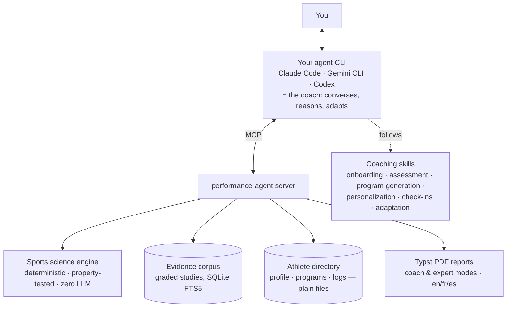

# PerformanceAgent

🏋️ **The first open-source AI Strength & Conditioning Coach powered by scientific research.**

It runs inside an AI agent CLI — a terminal program you chat with, such as Claude
Code, Gemini CLI, or Codex — and turns it into a professional coach that designs,
explains, monitors, and adapts your training. Don't have one of those yet? The
[Install](#install) section below gets you set up in five minutes. No backend, no
API key, no hosting. And it will tell you the truth when your goal is unrealistic:

```text
$ claude
> I run 10K in 55:00. I want 35:00 in 12 weeks.

🏋️ Coach: I evaluated your goal with the feasibility engine:

   Probability: 0.2% — I have to be honest, this is unrealistic.
   You're asking for a 36% improvement — about 3%/week sustained
   for 12 weeks. Beginners sustain roughly 1%/week.

   Counter-proposal: 46:30 in 12 weeks (~78% probability),
   then we reassess. Want me to build that program?

> Yes, generate it.

📄 Program written to athlete/programs/program-v1.md
   Every prescription carries its purpose, evidence grade (★★★★★ → ★☆☆☆☆),
   and citations verified against a local scientific corpus.
```


## Why another AI fitness coach? Because this one can't lie to you

LLM fitness coaches have two failure modes: they invent scientific references, and they
tell you what you want to hear. PerformanceAgent is architected so neither is possible:

- **LLMs narrate, the engine calculates.** Every number — feasibility probabilities,
  race predictions, training loads, periodization waves — comes from a deterministic,
  property-tested Python engine exposed as MCP tools (small functions the agent can
  call to get a real, computed answer instead of guessing one). The agent explains the
  math; it never does the math.
- **Citations can't be hallucinated.** The coach may only cite studies returned by the
  local evidence corpus (graded, DOI/PMID-verified). The PDF renderer hard-fails on any
  reference that isn't in the corpus.
- **Your data is files, not a cloud.** The athlete profile, programs, session logs, and
  check-ins live in a plain directory of markdown/YAML you can read, edit, diff, and sync.

## Install

PerformanceAgent isn't an app you open — it's a tool that plugs into an AI agent CLI
(a terminal program you chat with, like Claude Code). Once plugged in, you just talk
to it in plain language; no config files to edit, no commands to memorize. Five
minutes, three steps.

**Never used Claude Code before?** Install it first:

```bash
curl -fsSL https://claude.ai/install.sh | bash
```

(full instructions: [code.claude.com/docs](https://code.claude.com/docs/en/quickstart.md)).
You'll also need [`uv`](https://docs.astral.sh/uv/getting-started/installation/) — it
fetches the right Python version by itself, nothing else to install.

**Step 1 — plug in the coach.** Run this once, from any terminal:

```bash
claude mcp add performance-agent -s user \
  --env PERFORMANCE_AGENT_HOME=~/athlete-data -- uvx performance-agent
```

This downloads and registers the coach's "brain" (the engine, the science library, your
future athlete profile) as a tool Claude Code can call. `-s user` makes it available
everywhere, in any folder you later open `claude` from — skip it and it only works in
the one folder you ran this command from.

`~/athlete-data` is just a suggested path — pick any folder you like, it doesn't need
to exist yet. **Don't create it yourself**: the coach creates it automatically the
first time it saves something (your profile, a program, a session), not right after
this command runs — so don't worry if you don't see it appear immediately. That's also
where all your data will live as plain markdown/YAML files, nothing sent anywhere else.

**Step 2 — teach it how to coach.** The server above gives Claude the *tools* (the
math, the data). This step gives it the *coaching protocols* — when to ask what, when
to be honest about a goal, how to build a program:

```bash
git clone --depth 1 https://github.com/clementrx/Performance-agent
mkdir -p ~/.claude/skills
cp -R Performance-agent/skills/* ~/.claude/skills/
```

**Step 3 — fully quit and restart Claude Code.** This is the one step people miss: a
new tool is only loaded when a `claude` session *starts*, so if you already had one
open, close it completely and run `claude` again (a new tab of the same session won't
pick it up).

**Check it worked** — in your fresh session, ask:

```
> List the performance-agent tools.
```

You should see 23 tools. Then ask:

```
> What does your performance-coach skill do at the start of a session?
```

It should describe reading your profile first. If both work, you're done —
just talk to it, see the example below.

### Which AI tool can I use this with?

PerformanceAgent has two parts, and they don't travel together. The **MCP server**
(the engine, the science, your data) speaks a standard protocol — [MCP](https://modelcontextprotocol.io) —
that most AI coding tools understand today, so it works the same way everywhere. The
**coaching skills** (the honesty rules, the periodization know-how) are packaged in
Claude Code's native skill format, so anywhere else you paste the same instructions
into that tool's own "custom instructions" file — one extra step, not a blocker.

| Client | MCP tools | Coaching skills |
|---|---|---|
| Claude Code | ✅ native (steps above) | ✅ native |
| Gemini CLI | ✅ native | ⚠️ paste into `GEMINI.md` |
| Codex | ✅ native | ⚠️ paste into `AGENTS.md` |
| Cursor | ✅ native | ⚠️ paste into `.cursor/rules/*.mdc` |
| Windsurf | ✅ native | ⚠️ paste into its rules/memories settings |
| VS Code (GitHub Copilot) | ✅ native | ⚠️ paste into `.github/copilot-instructions.md` |
| Cline (VS Code extension) | ✅ native | ⚠️ paste into `.clinerules/` |

Setup commands for each, PDF reports (requires `typst`), how the data directory is
resolved, and troubleshooting: [docs/installing.md](docs/installing.md).

Not listed above (e.g. a Grok CLI) — if the tool supports MCP servers, the same
`uvx performance-agent` command works; if not, it can't be used yet. Not sure? Check
that tool's own docs for "MCP" support before assuming.

## Example: a 10K under 50 minutes, five months out

Every number below comes from the deterministic engine — run it yourself and you'll
get the same ones.

```text
$ claude
> I want to run a 10K under 50 minutes. I have 5 months. Coach me.

🏋️ Coach: [reads your profile — empty, so onboarding comes first]
   Gladly. Two facts before I judge that goal: your current 10K time
   (a recent race, or a time trial this week), and how long you've
   been training consistently?

> I ran 55:12 last month. About a year of running, 3× a week.

🏋️ Coach: Feasibility over your 21-week horizon:

   Probability: 84% — realistic, and worth committing to.
   You need a 9.4% improvement, i.e. 0.45%/week, while a runner at
   your training age can sustain about 1%/week. Comfortable margin —
   the plan can even absorb a missed week or two.

   Want me to build the program?

> Yes.

📄 Program written to athlete/programs/program-v1.md
   21 weeks, 3 sessions/week, periodized into mesocycles with deloads
   and a taper. Every session carries its purpose, evidence grade, and
   corpus-verified citations.
```

From there, the coach lives in your conversation and your files:

- **After a run** — *"Logged: 8 km easy, RPE 4"* → appended to the session log.
- **Every couple of weeks** — *"Check-in"* → the coach compares the plan against what
  you actually logged, quotes your training load, and flags drift.
- **When life happens** — *"I tweaked my ankle"* → the program is adapted and
  versioned (`program-v2.md`) with the reason recorded in the audit trail.

## How it works

Just here to use the coach? You can skip this section — it's for the curious and for
contributors. The diagram below shows what happens behind the scenes of the
conversation you saw above.



The skills encode professional coaching protocols (what to ask, when to be honest, how
to periodize, when to deload, how to run a check-in after two weeks of silence). The MCP
tools own every fact. The agent you already use glues it together with your existing
subscription — **zero additional LLM cost**.

## Features

A detailed changelog of what's built, for evaluating the project rather than using it.

**Working today**
- ✅ Deterministic sports-science engine, 93 engine tests (290 total) incl. property-based (Hypothesis):
  1RM estimation (Epley/Brzycki) · Riegel race prediction with enforced validity bounds ·
  session-RPE load & ACWR (with honest methodological caveats) · goal feasibility with
  explainable drivers · periodization waves (mesocycles, deloads, taper)
- ✅ Engine purity enforced by an architectural test (stdlib-only, no LLM/network/DB)
- ✅ CI with SHA-pinned actions, exact-pinned toolchain (uv, ruff, ty)
- ✅ MCP server exposing the engine as 9 tools — see [docs/installing.md](docs/installing.md)
- ✅ File-based athlete memory: schema-validated profile & goals, append-only session
  and check-in logs, versioned programs with a required-reason adaptation audit trail,
  and time awareness ("your last update was 14 days ago")
- ✅ Evidence corpus: live-verified starter corpus of 10 studies with grading ceilings
  enforced by schema, Porter-stemmed FTS5 full-text search, an anti-fabrication
  `check_citations` tool, and a maintainer verification CLI that asserts registry title
  matches before an entry ships
- ✅ Six coaching skills (Claude Code plugin format): session rituals, onboarding,
  honest goal assessment with counter-proposals, evidence-cited program generation,
  structured check-ins, versioned adaptation — each eval-guarded against tool drift
  and fabricated references
- ✅ Typst PDF reports (coach & expert modes, en/fr/es) behind a hard citation gate —
  a program citing anything outside the corpus refuses to render

**MVP in progress** — running (5K–marathon) and barbell-strength verticals first
- 🔜 Corpus growth toward ~200 studies (ongoing curation)

**Roadmap**
- **V2:** outcome simulation (Banister fitness–fatigue + Monte Carlo), nutrition &
  recovery skill, maintainer pipeline for live literature ingestion (shipped as corpus
  releases), more sports (Hyrox, football, tennis, tactical tests).
- **V3:** optional web front-end for non-technical athletes, reusing the same MCP
  server; coach dashboards; device integrations (VBT, force plates, HRV).

## Design principles

- **Evidence first** — systematic reviews → meta-analyses → RCTs → cohorts → expert
  opinion; every recommendation shows its grade, and thin evidence is labeled as such.
- **Honest by construction** — unrealistic goals get honest probabilities with the
  drivers behind them; contested metrics carry their caveats.
- **Agent-native** — your CLI agent is the interface; your subscription is the compute;
  your filesystem is the database.
- **Long-term athlete memory** — no conversation starts from zero.

## For developers

The engine is a pure Python package you can use directly:

```python
from performance_agent.engine import TrainingAge, endurance_feasibility

verdict = endurance_feasibility(
    current_time_s=3300, target_time_s=2100, weeks=12, training_age=TrainingAge.BEGINNER
)
verdict.probability  # 0.0023 — with improvement_needed, required and achievable rates
```

Repository layout: `src/performance_agent` (engine + MCP server) ·
`docs/superpowers/specs` (architecture blueprint) · `docs/superpowers/plans`
(implementation plans with as-built notes).

## Contributing

Early development, moving fast — see [CONTRIBUTING.md](CONTRIBUTING.md) for the dev
setup and review conventions. The blueprint in `docs/superpowers/specs/` is the source
of truth. Sports scientists and S&C coaches: the evidence-grading pipeline will need
expert reviewers — watch this space.

## License

Apache-2.0 — see [LICENSE](LICENSE).
