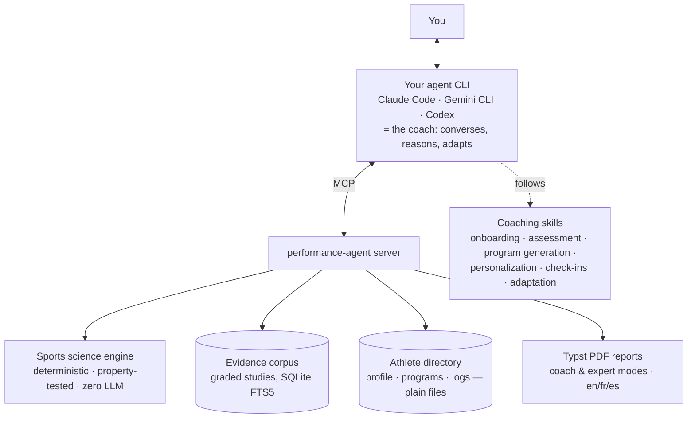

# PerformanceAgent

🏋️ **The first open-source AI Strength & Conditioning Coach powered by scientific research.**

It runs inside the AI agent you already pay for — Claude Code, Gemini CLI, Codex — and
turns it into a professional coach that designs, explains, monitors, and adapts your
training. No backend, no API key, no hosting. And it will tell you the truth when your
goal is unrealistic:

```text
$ claude
> I run 10K in 55:00. I want 35:00 in 12 weeks.

🏋️ Coach: I evaluated your goal with the feasibility engine:

   Probability: 0.2% — I have to be honest, this is unrealistic.
   You're asking for a 36% improvement — about 3%/week sustained
   for 12 weeks. Beginners sustain roughly 1%/week.

   Counter-proposal: 46:30 in 12 weeks (~78% probability),
   then we reassess. Want me to build that program?

> Yes, generate it.

📄 Program written to athlete/programs/program-v1.md
   Every prescription carries its purpose, evidence grade (★★★★★ → ★☆☆☆☆),
   and citations verified against a local scientific corpus.
```


## Why another AI fitness coach? Because this one can't lie to you

LLM fitness coaches have two failure modes: they invent scientific references, and they
tell you what you want to hear. PerformanceAgent is architected so neither is possible:

- **LLMs narrate, the engine calculates.** Every number — feasibility probabilities,
  race predictions, training loads, periodization waves — comes from a deterministic,
  property-tested Python engine exposed as MCP tools. The agent explains the math; it
  never does the math.
- **Citations can't be hallucinated.** The coach may only cite studies returned by the
  local evidence corpus (graded, DOI/PMID-verified). The PDF renderer hard-fails on any
  reference that isn't in the corpus.
- **Your data is files, not a cloud.** The athlete profile, programs, session logs, and
  check-ins live in a plain directory of markdown/YAML you can read, edit, diff, and sync.

## How it works



The skills encode professional coaching protocols (what to ask, when to be honest, how
to periodize, when to deload, how to run a check-in after two weeks of silence). The MCP
tools own every fact. The agent you already use glues it together with your existing
subscription — **zero additional LLM cost**.

## Features

**Working today**
- ✅ Deterministic sports-science engine, 93 engine tests (179 total) incl. property-based (Hypothesis):
  1RM estimation (Epley/Brzycki) · Riegel race prediction with enforced validity bounds ·
  session-RPE load & ACWR (with honest methodological caveats) · goal feasibility with
  explainable drivers · periodization waves (mesocycles, deloads, taper)
- ✅ Engine purity enforced by an architectural test (stdlib-only, no LLM/network/DB)
- ✅ CI with SHA-pinned actions, exact-pinned toolchain (uv, ruff, ty)
- ✅ MCP server exposing the engine as 9 tools — see [docs/installing.md](docs/installing.md)
- ✅ File-based athlete memory: schema-validated profile & goals, append-only session
  and check-in logs, versioned programs with a required-reason adaptation audit trail,
  and time awareness ("your last update was 14 days ago")

**MVP in progress** — running (5K–marathon) and barbell-strength verticals first
- 🔜 Evidence and report MCP tools
- 🔜 Curated evidence corpus (~200 graded studies) with anti-fabrication enforcement
- 🔜 Coaching skills: onboarding → honest assessment → program generation →
  personalization → check-ins & adaptation
- 🔜 Professional PDF reports (coach mode: terse · expert mode: full scientific
  rationale) in 🇬🇧 English · 🇫🇷 Français · 🇪🇸 Español

**Roadmap**
- **V2:** outcome simulation (Banister fitness–fatigue + Monte Carlo), nutrition &
  recovery skill, maintainer pipeline for live literature ingestion (shipped as corpus
  releases), more sports (Hyrox, football, tennis, tactical tests).
- **V3:** optional web front-end for non-technical athletes, reusing the same MCP
  server; coach dashboards; device integrations (VBT, force plates, HRV).

## Design principles

- **Evidence first** — systematic reviews → meta-analyses → RCTs → cohorts → expert
  opinion; every recommendation shows its grade, and thin evidence is labeled as such.
- **Honest by construction** — unrealistic goals get honest probabilities with the
  drivers behind them; contested metrics carry their caveats.
- **Agent-native** — your CLI agent is the interface; your subscription is the compute;
  your filesystem is the database.
- **Long-term athlete memory** — no conversation starts from zero.

## For developers

The engine is a pure Python package you can use directly:

```python
from performance_agent.engine import TrainingAge, endurance_feasibility

verdict = endurance_feasibility(
    current_time_s=3300, target_time_s=2100, weeks=12, training_age=TrainingAge.BEGINNER
)
verdict.probability  # 0.0023 — with improvement_needed, required and achievable rates
```

Repository layout: `src/performance_agent` (engine + MCP server) ·
`docs/superpowers/specs` (architecture blueprint) · `docs/superpowers/plans`
(implementation plans with as-built notes).

## Contributing

Early development, moving fast. The blueprint in `docs/superpowers/specs/` is the
source of truth. Sports scientists and S&C coaches: the evidence-grading pipeline will
need expert reviewers — watch this space.

## License

Apache-2.0 — see [LICENSE](LICENSE).
