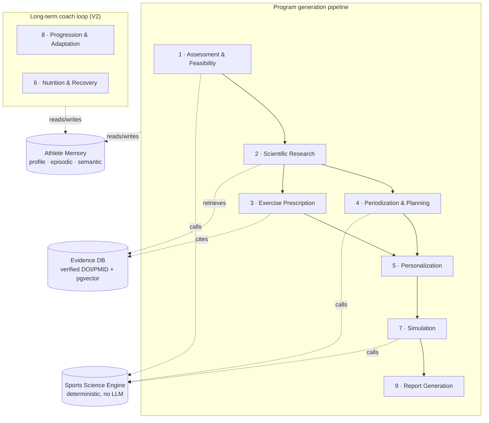

# PerformanceAgent

🏋️ **The first open-source AI Strength & Conditioning Coach powered by scientific research.**

It designs, explains, monitors, and adapts training programs for any athlete, any sport,
any goal — a 10K under 45 minutes, a Hyrox podium, a 70-meter javelin throw — and it will
tell you the truth when your goal is unrealistic.


```python
from performance_agent.engine import TrainingAge, endurance_feasibility

# "I run 10K in 55:00. I want 35:00 in 12 weeks."
verdict = endurance_feasibility(
    current_time_s=3300, target_time_s=2100, weeks=12, training_age=TrainingAge.BEGINNER
)

verdict.probability          # 0.0023  — an honest coach says no
verdict.improvement_needed   # 0.36    — you're asking for a 36% improvement
verdict.required_weekly_rate # 0.0303  — that's 3%/week, sustained for 12 weeks
verdict.achievable_weekly_rate  # 0.0100 — beginners sustain about 1%/week
```

**This code runs today.** No mock, no vaporware — it's the deterministic sports-science
engine at the core of the platform, and every number it returns comes with the drivers
that produced it.

## Why another AI fitness app? Because this one can't hallucinate a citation

Every LLM fitness coach has the same two failure modes: it invents scientific references,
and it tells you what you want to hear. PerformanceAgent is architected so neither is
possible:

- **Citations are foreign keys, not text.** Agents can only cite studies that exist in a
  verified evidence database (DOI/PMID resolved against PubMed/Semantic Scholar). A guard
  blocks any reference in the output that isn't in the retrieval set.
- **LLMs narrate, the engine calculates.** Feasibility scores, race predictions, training
  loads, and periodization math live in a pure, deterministic, property-tested Python
  package with zero LLM dependencies — enforced by an architectural test that fails the
  build if anyone imports an LLM SDK into `engine/`.
- **Evidence is graded, and the grade is shown.** Every recommendation carries a
  confidence rating derived from the study types behind it: ★★★★★ systematic reviews
  down to ★☆☆☆☆ expert opinion. When evidence is thin, the coach says so.

## Multi-agent architecture

Nine specialized agents collaborate over a shared athlete state, orchestrated as
LangGraph graphs:



The agents ask questions when they need to (equipment, schedule, injuries), stream their
reasoning to the UI, and every decision is traced — a program can always answer
*"why is this session here?"*

## What a generated program looks like

> *Illustrative target output — the generation pipeline is the current MVP milestone
> (see roadmap). The feasibility numbers are real engine output today.*

```text
GOAL        10K in 45:00 · 16 weeks · intermediate · 4 sessions/week
FEASIBILITY 80% — required progression 0.27%/week vs ~0.5%/week sustainable

WEEK 5 OF 16 — Accumulation block (volume 1.05x, intensity 1.02x)
────────────────────────────────────────────────────────────────
Tue  Threshold — 2 × 15 min @ 4:41/km (RPE 7), 3 min jog recovery
     Purpose: raise lactate threshold, the main limiter identified in week 1
     Evidence: threshold training 2x/week in trained runners  ★★★★☆
Thu  Easy run — 45 min @ 5:45/km + 6 × 20 s strides
Sat  Strength — squat 4×6 @ 75% 1RM, rest 3 min · single-leg RDL 3×8/side
     Purpose: running economy via maximal strength  ★★★★★ (meta-analyses)
Sun  Long run — 75 min progressive, last 15 min @ marathon effort
────────────────────────────────────────────────────────────────
Week 8 = deload (volume 0.6x) · Week 16 = taper (volume 0.5x, intensity held)
```

📄 **Professional PDF reports** (coach mode: terse instructions · expert mode: full
scientific rationale with references) ship with the report generator — preview will land
here when it does.

## Features

**Working today**
- ✅ Deterministic sports-science engine, 93 tests incl. property-based (Hypothesis):
  - 1RM estimation (Epley, Brzycki) and %-based load prescription
  - Riegel race-time prediction with enforced validity bounds (1.5 km – marathon)
  - Session-RPE training load, weekly blocks, ACWR (with honest methodological caveats)
  - Goal feasibility scoring with explainable drivers — the honest-coach core
  - Periodization wave generation (mesocycles, deloads, taper)
- ✅ Engine purity enforced by an architectural test (stdlib-only, no LLM/network/DB)
- ✅ CI with SHA-pinned actions, exact-pinned toolchain (uv, ruff, ty)

**MVP in progress** — running (5K–marathon) and barbell-strength verticals first
- 🔜 FastAPI backend: athlete profiles, equipment, goals, session logging
- 🔜 Evidence database: curated seed corpus (~200 graded studies), hybrid retrieval
- 🔜 The nine agents (LangGraph) with anti-fabrication guard and eval harness
- 🔜 Program generation end-to-end + Typst PDF reports (coach / expert modes)
- 🔜 Next.js web app, onboarding wizard, multilingual (🇬🇧 English · 🇫🇷 Français · 🇪🇸 Español)
- 🔜 Self-hosting via `docker compose up` — bring your own LLM key (Claude, OpenAI, local)

**Roadmap**
- **V2 — the coach:** persistent memory across conversations, scheduled check-ins
  ("your last update was 14 days ago — how did the sessions go?"), plan adaptation with
  versioned audit trail, outcome simulation (Banister fitness–fatigue + Monte Carlo),
  nutrition & recovery agent, live literature ingestion, more sports (Hyrox, football,
  tennis, tactical tests).
- **V3 — the professional platform:** multi-athlete coach dashboard, teams, device
  integrations (VBT, force plates, HRV), community sport-module plugins.

## Design principles

- **Evidence first** — recommendations trace to a graded, verifiable evidence database;
  the hierarchy runs systematic reviews → meta-analyses → RCTs → cohorts → expert opinion.
- **LLMs narrate, the engine calculates** — all sports-science math is deterministic,
  reproducible, and tested down to ULP-level float behavior.
- **Honest by construction** — unrealistic goals get honest probabilities, contested
  metrics (like ACWR) carry their caveats in the docstring, and thin evidence is labeled
  as such.
- **Long-term athlete memory** — no conversation starts from zero.
- **Self-hosted and open** — your data stays on your machine; Apache-2.0.

## Repository layout

- `apps/api` — Python backend (FastAPI, agents, sports science engine)
- `docs/superpowers/specs` — architecture blueprint and design docs
- `docs/superpowers/plans` — implementation plans (with as-built deviation notes)

## Contributing

The project is in early development and moving fast. The architecture blueprint in
`docs/superpowers/specs/` is the source of truth; issues and PRs are welcome once the
MVP backbone lands. Sports scientists and S&C coaches: the evidence-grading pipeline
will need expert reviewers — watch this space.

## License

Apache-2.0 — see [LICENSE](LICENSE).
