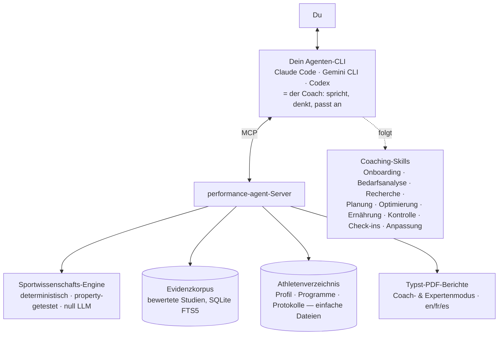

# PerformanceAgent

🏋️ **Der erste Open-Source-KI-Coach für Kraft- und Ausdauertraining auf Basis wissenschaftlicher Forschung.**

[English](../../README.md) · [Français](README.fr.md) · [Español](README.es.md) · **Deutsch** · [Italiano](README.it.md)


Er läuft innerhalb eines KI-Agenten für die Kommandozeile — ein Terminalprogramm, mit
dem man chattet, wie Claude Code, Gemini CLI oder Codex — und verwandelt ihn in einen
professionellen Coach, der dein Training plant, erklärt, überwacht und anpasst. Kein
Backend, kein API-Schlüssel, kein Hosting, kein zusätzliches Abo. Und er sagt dir die
Wahrheit, wenn dein Ziel unrealistisch ist:

```text
$ claude
> Ich laufe 10 km in 55:00. Ich will 35:00 in 12 Wochen.

🏋️ Coach: Ich habe dein Ziel mit der Machbarkeits-Engine bewertet:

   Wahrscheinlichkeit: 0,2 % — ich muss ehrlich sein, das ist
   unrealistisch. Du verlangst eine Verbesserung von 36 % — etwa
   3 %/Woche über 12 Wochen. Anfänger halten rund 1 %/Woche durch.

   Gegenvorschlag: 46:30 in 12 Wochen (~78 % Wahrscheinlichkeit),
   danach bewerten wir neu. Soll ich dir dieses Programm bauen?
```

## Warum noch ein KI-Fitness-Coach? Weil dieser dich nicht anlügen kann

LLM-Fitness-Coaches scheitern auf zwei Arten: Sie erfinden wissenschaftliche Quellen,
und sie erzählen dir, was du hören willst. PerformanceAgent ist so gebaut, dass beides
unmöglich ist:

- **Das LLM erzählt, die Engine rechnet.** Jede Zahl — Machbarkeits-Wahrscheinlichkeiten,
  Wettkampfprognosen, Trainingslasten, Periodisierungswellen — stammt aus einer
  deterministischen, property-getesteten Python-Engine. Der Agent erklärt die
  Mathematik; er rechnet nie selbst.
- **Zitate können nicht halluziniert werden.** Der Coach darf nur Studien zitieren,
  die aus dem lokalen Evidenzkorpus stammen (bewertet, DOI/PMID-verifiziert). Der
  PDF-Renderer bricht bei jeder Referenz außerhalb des Korpus hart ab.
- **Deine Daten sind Dateien, keine Cloud.** Profil, Programme, Trainingsprotokolle
  und Check-ins liegen in einem einfachen Verzeichnis aus Markdown/YAML, das du lesen,
  bearbeiten, vergleichen und synchronisieren kannst.

## Installation (5 Minuten, 3 Schritte)

PerformanceAgent ist keine App, die man öffnet — er wird in einen KI-Agenten für die
Kommandozeile eingesteckt. Danach sprichst du einfach in natürlicher Sprache mit ihm;
keine Konfigurationsdateien, keine Befehle zum Auswendiglernen.

**Noch nie Claude Code benutzt?** Installiere es zuerst:

```bash
curl -fsSL https://claude.ai/install.sh | bash
```

(vollständige Anleitung: [code.claude.com/docs](https://code.claude.com/docs/en/quickstart.md)).
Du brauchst außerdem [`uv`](https://docs.astral.sh/uv/getting-started/installation/) —
es holt sich die richtige Python-Version selbst, sonst ist nichts zu installieren.

**Schritt 1 — den Coach einstecken.** Einmalig in einem beliebigen Terminal ausführen:

```bash
claude mcp add performance-agent -s user \
  --env PERFORMANCE_AGENT_HOME=~/athlete-data -- uvx performance-agent
```

Das registriert das „Gehirn“ des Coaches (die Engine, die Wissenschaftsbibliothek,
dein zukünftiges Athletenprofil) als Werkzeug, das Claude Code aufrufen kann.
`-s user` macht es in jedem Ordner verfügbar, in dem du später `claude` öffnest.
`~/athlete-data` ist nur ein Vorschlag — wähle einen beliebigen Ordner, er muss nicht
existieren: Der Coach legt ihn beim ersten Speichern an. Dort liegen alle deine Daten
als einfache Dateien; nichts wird irgendwohin gesendet.

**Schritt 2 — ihm das Coaching beibringen.** Schritt 1 gab Claude die *Werkzeuge* (die
Mathematik, die Daten). Dieser Schritt gibt ihm die *Coaching-Protokolle* — was wann
zu fragen ist, wann man bei einem Ziel ehrlich sein muss, wie man ein Programm baut:

```bash
git clone --depth 1 https://github.com/clementrx/Performance-agent
mkdir -p ~/.claude/skills
cp -R Performance-agent/skills/* ~/.claude/skills/
```

**Schritt 3 — Claude Code vollständig beenden und neu starten.** Ein neues Werkzeug
wird nur beim *Start* einer `claude`-Sitzung geladen: Schließe jede offene Sitzung
komplett und führe `claude` erneut aus.

**Prüfen, ob es funktioniert hat** — frage in der frischen Sitzung:

```
> Liste die performance-agent-Werkzeuge auf.
```

Du solltest 76 Werkzeuge sehen. Wenn ja, bist du fertig — sprich einfach mit ihm.

## Schritt für Schritt benutzen

1. **Öffne ein Terminal und starte deinen Agenten** (`claude`).
2. **Nenne dein Ziel in natürlicher Sprache** — jede Sprache funktioniert. *„Ich will
   10 km unter 50 Minuten laufen“*.
3. **Beantworte die Fragen des Coaches.** Beim ersten Mal führt er ein kurzes
   Aufnahmegespräch (aktuelles Niveau, Trainingshistorie, Zeitplan, Ausrüstung) und
   speichert dein Profil.
4. **Erhalte ein ehrliches Urteil.** Die Machbarkeits-Engine bewertet dein Ziel; ist
   es außer Reichweite, bekommst du die echte Wahrscheinlichkeit und einen
   Gegenvorschlag.
5. **Sag ja** — das Programm wird nach `athlete/programs/program-v1.md` geschrieben,
   periodisiert in Zyklen mit Deloads und Taper; jede Vorgabe trägt ihren Zweck, ihre
   Evidenzstufe (★★★★★ → ★☆☆☆☆) und verifizierte Zitate.
6. **Protokolliere jedes Training in einer Zeile** — *„Geloggt: 8 km locker, RPE 4“*.
7. **Sag alle zwei Wochen „Check-in“** — der Coach vergleicht Plan und Realität,
   nennt deine Trainingslast und meldet Abweichungen.
8. **Wenn das Leben dazwischenkommt** — *„Ich habe mir den Knöchel verdreht“*,
   *„Nächste Woche kann ich nur zweimal trainieren“* — wird das Programm angepasst
   und versioniert (`program-v2.md`), mit dem Grund im Audit-Protokoll.

## Drei echte Beispiele

Die Machbarkeitszahlen unten stammen aus der deterministischen Engine — führe sie
selbst aus und du bekommst dieselben. Du willst die fertigen Programmdateien sehen?
Jedes dieser drei Gespräche endet mit einem vollständigen Programm — durchstöbere sie
in [`examples/`](../../examples/), in allen fünf Sprachen.

### 1. 10 km unter 50 Minuten laufen

```text
> Ich will 10 km unter 50 Minuten laufen. Ich habe 5 Monate. Coache mich.

🏋️ Coach: Zwei Fakten, bevor ich dieses Ziel beurteile: deine aktuelle
   10-km-Zeit, und wie lange trainierst du schon regelmäßig?

> Ich bin letzten Monat 55:12 gelaufen. Etwa ein Jahr Laufen, 3× pro Woche.

🏋️ Coach: Machbarkeit über deinen Horizont von 21 Wochen:

   Wahrscheinlichkeit: 84 % — realistisch und die Verpflichtung wert.
   Du brauchst eine Verbesserung von 9,5 %, also 0,45 %/Woche, während
   ein Läufer mit deiner Erfahrung etwa 1 %/Woche durchhält.
   Komfortable Marge.

   Soll ich das Programm bauen?

> Ja.

📄 Programm geschrieben nach athlete/programs/program-v1.md
   21 Wochen, 3 Läufe/Woche: eine Intervalleinheit, ein Tempolauf,
   ein langer Lauf — periodisiert mit Deloads und 10-Tage-Taper.
```

### 2. Einen Hyrox in 3 Monaten vorbereiten

```text
> Ich habe mich für einen Hyrox in 3 Monaten angemeldet. Bau mir einen Plan.

🏋️ Coach: Hyrox sind 8 km Laufen, unterbrochen von 8 Kraftstationen —
   wir trainieren also beides, zusammen. Drei Fakten: deine 10-km-Zeit
   (oder eine Schätzung), dein Kraftsport-Hintergrund, und wie viele
   Tage pro Woche kannst du trainieren?

> 10 km in etwa 52 min, ich mache zweimal pro Woche Krafttraining, 4 Einheiten gehen.

🏋️ Coach: Gute Basis für ein starkes erstes Finish. Ehrliche Anmerkung:
   12 Wochen reichen, um solide zu finishen und Spaß zu haben; eine
   Podiumszeit bräuchte einen längeren Anlauf — das sage ich dir lieber
   jetzt.

   Plan mit 4 Tagen: ein Lauf-Intervalltag, ein Stations-Krafttag
   (Sled, Ausfallschritte, Wall Balls), ein „Compromised Running“-Brick
   (Laufen → Station → Laufen, die Fähigkeit, die Hyrox wirklich
   abprüft), ein lockerer langer Lauf. Deloads in Woche 4 und 8, Taper
   in der Wettkampfwoche. Bauen?

> Ja.

📄 Programm geschrieben nach athlete/programs/program-v1.md
```

### 3. Sichtbare Bauchmuskeln und dickere Arme in 3 Monaten

```text
> Ich will sichtbare Bauchmuskeln und dickere Arme in 3 Monaten.

🏋️ Coach: Das sind zwei verschiedene physiologische Ziele — Arme
   wachsen mit Volumen und genug Kalorien; Bauchmuskeln zeigen sich bei
   niedrigem Körperfett, was meist ein Defizit verlangt. Bevor ich etwas
   verspreche: Größe, Gewicht, Trainingserfahrung und Einheiten pro
   Woche?

> 1,78 m, 82 kg, zwei Jahre Krafttraining, 4 Einheiten pro Woche.

🏋️ Coach: Ehrliches Urteil: In 12 Wochen kannst du bei beidem echte
   Fortschritte machen, aber nicht beides maximieren — Rekomposition ist
   nach zwei Jahren Training langsam. Die realistische Version:

   - Moderates Kaloriendefizit mit hohem Proteinziel (der
     Ernährungs-Skill quantifiziert es, mit Sicherheitsgrenzen).
   - Oberkörper-Priorität: 12–16 harte Sätze/Woche für die Arme,
     schwere Grundübungen bleiben drin, um die Kraft im Defizit zu
     schützen.
   - 3 Krafttage + 1 Conditioning-Tag.
   - Erwartung in Woche 12: sichtbar vollere Arme, „gezeichnete“
     Bauchmuskeln, wenn du bei etwa 15–18 % Körperfett startest;
     schlanker als das dauert länger, und das sage ich dir bei jedem
     Check-in, statt dich raten zu lassen.

   Willst du das Programm?

> Ja.

📄 Programm geschrieben nach athlete/programs/program-v1.md
```

## Mit welchem KI-Tool kann ich das benutzen?

Der **MCP-Server** (Engine, Wissenschaft, Daten) spricht ein Standardprotokoll —
[MCP](https://modelcontextprotocol.io) — das die meisten KI-Tools verstehen. Die
**Coaching-Skills** sind im nativen Skill-Format von Claude Code verpackt; anderswo
fügst du dieselben Anweisungen in die „Custom Instructions“-Datei des jeweiligen Tools
ein.

| Client | MCP-Werkzeuge | Coaching-Skills |
|---|---|---|
| Claude Code | ✅ nativ (Schritte oben) | ✅ nativ |
| Gemini CLI | ✅ nativ | ⚠️ in `GEMINI.md` einfügen |
| Codex | ✅ nativ | ⚠️ in `AGENTS.md` einfügen |
| Cursor | ✅ nativ | ⚠️ in `.cursor/rules/*.mdc` einfügen |
| Windsurf | ✅ nativ | ⚠️ in seine Rules/Memories-Einstellungen einfügen |
| VS Code (GitHub Copilot) | ✅ nativ | ⚠️ in `.github/copilot-instructions.md` einfügen |
| Cline (VS-Code-Erweiterung) | ✅ nativ | ⚠️ in `.clinerules/` einfügen |

Setup-Befehle für jeden Client, PDF-Berichte (benötigt `typst`), Auflösung des
Datenverzeichnisses und Fehlerbehebung: [docs/installing.md](../installing.md). Jedes
andere Tool mit MCP-Unterstützung funktioniert mit demselben Befehl
`uvx performance-agent`.

## Wie es funktioniert

Nur zum Trainieren hier? Überspring diesen Abschnitt — er ist für Neugierige und
Mitwirkende.



Die Skills kodieren die Protokolle eines professionellen Coaches (was fragen, wann
ehrlich sein, wie periodisieren, wann entlasten). Die MCP-Werkzeuge besitzen jeden
Fakt. Der Agent, den du bereits nutzt, fügt alles mit deinem bestehenden Abo zusammen
— **null zusätzliche LLM-Kosten**.

**Heute verfügbar:** deterministische Engine (1RM-Schätzung, Riegel-Wettkampfprognose,
Session-RPE-Last & ACWR, Monotonie/Strain, Form-Ermüdung CTL/ATL/TSB,
Readiness-Einstufung, Budgetierung externer Last, Zielmachbarkeit,
Periodisierungswellen, rückwärts geplante Saison aus einem datierten Kalender,
Sitzungs-Autoregulation am Tag selbst (Readiness-basierte Anpassung, Zeitkompression,
Übungssubstitution), Sequenzierung innerhalb der Woche & Interferenzschutz,
individualisierte Rekalibrierung aus den Logs des Athleten (gemessene
Progressionsrate ehrlich über n, Soll-Ist-Compliance, Volumentoleranz, versioniertes
Antwortprofil), die die Machbarkeit neu berechnet, datengestützte
Entlastungsempfehlungen und eine schrittweise Rückkehr zur Last nach einer Pause,
proaktives Follow-up, das Fälliges hervorhebt, und eine deterministische
End-to-End-Simulation (ohne LLM); 1016 Tests inkl. property-based) · 76 MCP-Werkzeuge ·
dateibasiertes Athletengedächtnis mit Saisonkalender, Readiness-Logs, versionierten
maschinenlesbaren Programmen, Tages-Anpassungsprotokoll, versioniertem Antwortprofil
und Anpassungs-Audit-Protokoll · Import von Aktivitätsdateien (.fit/.tcx/.gpx/CSV) ·
DOI/PMID/ISBN-verifizierter Evidenzkorpus mit Anti-Fabrikations-Zitatprüfung ·
Live-Evidenzsuche (PubMed, OpenAlex, Crossref, Semantic Scholar) hinter doppelter
Verifikation · zwölf Coaching-Skills inkl. verpflichtendem Liefer-Gate mit
adversarialer Zweitmeinung · Typst-PDF-Berichte (en/fr/es) hinter einer harten
Zitatsperre.

**Roadmap:** Korpusausbau auf ~200 Studien · Ergebnissimulation (Banister +
Monte Carlo) · weitere Sport-Vertikalen (Hyrox-spezifische Engine-Werkzeuge, Fußball,
Tennis) · optionales Web-Frontend auf demselben MCP-Server.

## Designprinzipien

- **Evidenz zuerst** — systematische Reviews → Metaanalysen → RCTs → Kohorten →
  Expertenmeinung; jede Empfehlung zeigt ihre Stufe, und dünne Evidenz wird als solche
  gekennzeichnet.
- **Ehrlich per Konstruktion** — unrealistische Ziele bekommen ehrliche
  Wahrscheinlichkeiten samt ihren Treibern; umstrittene Metriken tragen ihre Vorbehalte.
- **Agenten-nativ** — dein CLI-Agent ist die Oberfläche; dein Abo ist die Rechenleistung;
  dein Dateisystem ist die Datenbank.
- **Langfristiges Athletengedächtnis** — kein Gespräch beginnt bei null.

## Für Entwickler

Die Engine ist ein reines Python-Paket, das du direkt nutzen kannst:

```python
from performance_agent.engine import TrainingAge, endurance_feasibility

verdict = endurance_feasibility(
    current_time_s=3300, target_time_s=2100, weeks=12, training_age=TrainingAge.BEGINNER
)
verdict.probability  # 0.0023 — mit improvement_needed, erforderlicher und erreichbarer Rate
```

Repository-Struktur: `src/performance_agent` (Engine, Evidenz, Speicher, Reports,
MCP-Server) · `skills/` (Coaching-Protokolle) · `docs/` (Installation & Nutzung) ·
`examples/` (vollständige Beispielgespräche in fünf Sprachen).

## Mitwirken

Frühe Entwicklung, hohes Tempo — siehe [CONTRIBUTING.md](../../CONTRIBUTING.md) für
Dev-Setup und Review-Konventionen. Sportwissenschaftler und Athletiktrainer: Die
Evidenzbewertungs-Pipeline wird Fachgutachter brauchen.

## Lizenz

Apache-2.0 — siehe [LICENSE](../../LICENSE).
