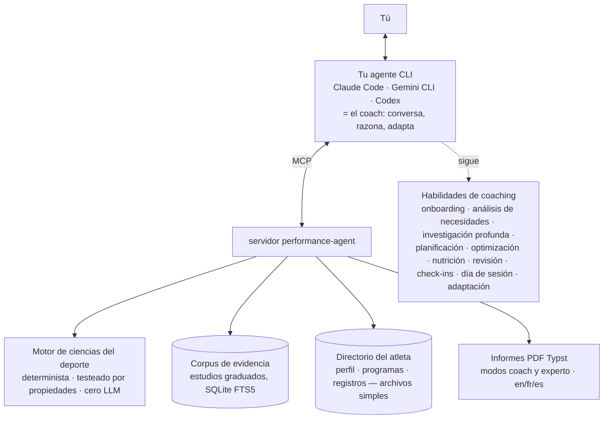

# PerformanceAgent

🏋️ **El primer coach IA open-source de fuerza y acondicionamiento basado en investigación científica.**

[English](../../README.md) · [Français](README.fr.md) · **Español** · [Deutsch](README.de.md) · [Italiano](README.it.md)


Funciona dentro de un agente de IA de línea de comandos — un programa de terminal con
el que conversas, como Claude Code, Gemini CLI o Codex — y lo convierte en un
entrenador profesional que diseña, explica, supervisa y adapta tu entrenamiento. Sin
backend, sin clave API, sin hosting, sin suscripción adicional. Y te dice la verdad
cuando tu objetivo es poco realista:

```text
$ claude
> Corro los 10K en 55:00. Quiero 35:00 en 12 semanas.

🏋️ Coach: Evalué tu objetivo con el motor de viabilidad:

   Probabilidad: 0,2 % — tengo que ser honesto, es poco realista.
   Pides una mejora del 36 %, unos 3 %/semana sostenidos durante
   12 semanas. Un principiante sostiene aproximadamente 1 %/semana.

   Contrapropuesta: 46:30 en 12 semanas (~78 % de probabilidad),
   y luego reevaluamos. ¿Te construyo ese programa?
```

## ¿Por qué otro coach IA? Porque este no puede mentirte

Los coaches fitness basados en LLM fallan de dos maneras: inventan referencias
científicas y te dicen lo que quieres oír. PerformanceAgent está arquitecturado para
que ninguna de las dos sea posible:

- **El LLM narra, el motor calcula.** Cada número — probabilidades de viabilidad,
  predicciones de carrera, cargas de entrenamiento, ondas de periodización — sale de
  un motor Python determinista y testeado por propiedades. El agente explica las
  matemáticas; nunca las hace.
- **Las citas no se pueden alucinar.** El coach solo puede citar estudios devueltos
  por el corpus local de evidencia (graduados, verificados por DOI/PMID). El
  renderizador de PDF falla de inmediato ante cualquier referencia fuera del corpus.
- **Tus datos son archivos, no una nube.** Perfil, programas, registros de sesiones y
  revisiones viven en un directorio simple de markdown/YAML que puedes leer, editar,
  comparar y sincronizar.

## Instala una vez — luego, una carpeta por atleta

PerformanceAgent no es una app que se abre — se conecta a un agente de IA de línea de
comandos. Lo instalas **una sola vez** (abajo) y, a partir de ahí, entrenar a alguien
son tres gestos:

```bash
mkdir -p ~/coaching/marie && cd ~/coaching/marie && claude
```

**Crea una carpeta, haz `cd` dentro, lanza `claude` — y ya estás entrenando.** Esa
carpeta *es* el atleta: perfil, programas, registros de sesiones y check-ins viven
todos dentro como archivos simples que puedes leer, editar, versionar y respaldar.
Nada se envía a ninguna parte. Entrenar a varios atletas es solo tener varias carpetas
— haz `cd` a la correcta y el coach retoma donde lo dejaste. Luego le hablas en
lenguaje natural; sin archivos de configuración, sin comandos que memorizar.

### Instalación única (5 minutos, 3 pasos)

**¿Nunca has usado Claude Code?** Instálalo primero:

```bash
curl -fsSL https://claude.ai/install.sh | bash
```

(instrucciones completas: [code.claude.com/docs](https://code.claude.com/docs/en/quickstart.md)).
También necesitas [`uv`](https://docs.astral.sh/uv/getting-started/installation/) —
descarga por sí solo la versión correcta de Python, nada más que instalar.

**Paso 1 — conectar el coach.** Ejecuta esto una sola vez, desde cualquier terminal:

```bash
claude mcp add performance-agent -s user -- uvx performance-agent
```

Esto registra el «cerebro» del coach (el motor, la biblioteca científica, tu futuro
perfil de atleta) como una herramienta que Claude Code puede invocar. `-s user` lo
hace disponible desde cualquier carpeta donde luego lances `claude` — que es lo que
hace funcionar lo de una carpeta por atleta.

**Paso 2 — enseñarle a entrenar.** El paso 1 le dio a Claude las *herramientas* (las
matemáticas, los datos). Este paso le da los *protocolos de coaching* — qué preguntar
y cuándo, cuándo ser honesto con un objetivo, cómo construir un programa:

```bash
git clone --depth 1 https://github.com/clementrx/Performance-agent
mkdir -p ~/.claude/skills
cp -R Performance-agent/skills/* ~/.claude/skills/
```

**Paso 3 — cierra Claude Code por completo y vuelve a abrirlo.** Una herramienta nueva
solo se carga cuando una sesión de `claude` *arranca*: cierra cualquier sesión abierta
y ejecuta `claude` de nuevo.

**Comprueba que funcionó** — abre una carpeta de atleta y pregunta:

```
> Lista las herramientas de performance-agent.
```

Deberías ver 102 herramientas. Si es así, ya está — crea una carpeta y empieza a
entrenar.

> **¿En un host que no puede elegir la carpeta de lanzamiento?** Claude Desktop y algún
> otro host MCP siempre arrancan en el mismo sitio. Ahí, define `PERFORMANCE_AGENT_HOME`
> hacia la carpeta del atleta en la configuración del servidor en vez de hacer `cd`.

## Cómo usarlo, paso a paso

1. **Haz `cd` a la carpeta del atleta y arranca tu agente** (`claude`) — una carpeta
   vacía para un atleta nuevo, una existente para retomar su historial.
2. **Di tu objetivo en lenguaje natural** — en el idioma que prefieras. *«Quiero
   correr los 10K en menos de 50 minutos»*.
3. **Responde a las preguntas del coach.** La primera vez hace una breve entrevista
   inicial (nivel actual, historial, horarios, equipamiento) y guarda tu perfil.
4. **Recibe un veredicto honesto.** El motor de viabilidad puntúa tu objetivo; si está
   fuera de alcance, obtienes la probabilidad real y una contrapropuesta.
5. **Di que sí** — el programa se escribe en `programs/program-20260712.md`,
   periodizado en ciclos con descargas y tapering, y cada prescripción lleva su
   propósito, su grado de evidencia (★★★★★ → ★☆☆☆☆) y citas verificadas. Al lado,
   `program-20260712.html` es una página de sesión autónoma para el gimnasio: cada
   ejercicio de fuerza con su GIF animado, la técnica paso a paso en tu idioma,
   series, repeticiones, carga y descanso — totalmente offline, envíala a tu
   móvil. (Medios de
   [exercises-dataset](https://github.com/hasaneyldrm/exercises-dataset),
   clonado automáticamente en segundo plano al arrancar el servidor.)
6. **Después de cada sesión, regístrala en una línea** — *«Sesión: 8 km suaves, RPE 4»*.
7. **Cada dos semanas, di «Revisión»** — el coach compara el plan con la realidad,
   cita tu carga de entrenamiento y señala las desviaciones.
8. **Cuando la vida se interpone** — *«Me torcí el tobillo»*, *«La semana que viene
   solo puedo entrenar dos veces»* — el programa se adapta y se versiona
   (nouveau fichier daté), con el motivo registrado en el historial de auditoría.

## Tres ejemplos reales

Los números de viabilidad de abajo salen del motor determinista — ejecútalo tú mismo y
obtendrás los mismos. ¿Quieres ver los programas resultantes? Cada una de estas tres
conversaciones termina con un programa completo — explóralos en
[`examples/`](../../examples/), en los cinco idiomas.

### 1. Correr los 10K en menos de 50 minutos

```text
> Quiero correr los 10K en menos de 50 minutos. Tengo 5 meses. Entréname.

🏋️ Coach: Dos datos antes de juzgar ese objetivo: tu tiempo actual en
   10K, y ¿cuánto llevas entrenando con constancia?

> Corrí 55:12 el mes pasado. Un año corriendo, 3 veces por semana.

🏋️ Coach: Viabilidad en tu horizonte de 21 semanas:

   Probabilidad: 84 % — realista, y merece el compromiso.
   Necesitas una mejora del 9,5 %, es decir 0,45 %/semana, mientras
   que un corredor con tu experiencia sostiene alrededor del
   1 %/semana. Margen cómodo.

   ¿Te construyo el programa?

> Sí.

📄 Programa escrito en programs/program-20260712.md
   21 semanas, 3 carreras/semana: una sesión de intervalos, un tempo
   y una tirada larga — periodizado con descargas y tapering de 10 días.
```

### 2. Preparar un Hyrox en 3 meses

```text
> Me apunté a un Hyrox dentro de 3 meses. Hazme un plan.

🏋️ Coach: El Hyrox son 8 km de carrera interrumpidos por 8 estaciones
   de fuerza — así que entrenamos ambas cosas, juntas. Tres datos: tu
   tiempo en 10K (o una estimación), tu experiencia con las pesas, y
   ¿cuántos días por semana puedes entrenar?

> 10K en unos 52 min, levanto pesas dos veces por semana, puedo hacer 4 sesiones.

🏋️ Coach: Buena base para un primer Hyrox sólido. Nota honesta: 12
   semanas bastan para terminar bien y disfrutarlo; aspirar a un tiempo
   de podio necesitaría más recorrido — prefiero decírtelo ahora.

   Plan de 4 días: un día de intervalos de carrera, un día de fuerza de
   estaciones (sled, zancadas, wall balls), un encadenamiento de
   «carrera comprometida» (correr → estación → correr, la habilidad que
   el Hyrox realmente evalúa) y una tirada larga suave. Descargas en las
   semanas 4 y 8, tapering en la semana de la carrera. ¿Lo construyo?

> Sí.

📄 Programa escrito en programs/program-20260712.md
```

### 3. Abdominales marcados y brazos grandes en 3 meses

```text
> Quiero abdominales marcados y brazos más grandes en 3 meses.

🏋️ Coach: Son dos objetivos fisiológicos distintos — los brazos crecen
   con volumen y calorías suficientes; los abdominales se ven con un
   porcentaje de grasa bajo, lo que suele exigir un déficit. Antes de
   prometer nada: estatura, peso, experiencia entrenando y sesiones por
   semana?

> 1,78 m, 82 kg, dos años levantando pesas, 4 sesiones por semana.

🏋️ Coach: Veredicto honesto: en 12 semanas puedes progresar de verdad
   en ambas cosas, pero no maximizar ambas — la recomposición corporal
   es lenta con dos años de experiencia. La versión realista:

   - Déficit calórico moderado con un objetivo alto de proteína
     (la habilidad Nutricionista lo cuantifica, con salvaguardas).
   - Prioridad al tren superior: 12–16 series duras/semana para brazos,
     manteniendo trabajo pesado multiarticular para proteger la fuerza
     durante el déficit.
   - 3 días de pesas + 1 día de acondicionamiento.
   - Esperado en la semana 12: brazos visiblemente más llenos y
     abdominales «marcados» si partes de un 15–18 % de grasa corporal;
     más definición lleva más tiempo, y te lo diré en cada revisión en
     lugar de dejarte adivinar.

   ¿Quieres el programa?

> Sí.

📄 Programa escrito en programs/program-20260712.md
```

## ¿Con qué herramienta de IA puedo usarlo?

El **servidor MCP** (motor, ciencia, datos) habla un protocolo estándar —
[MCP](https://modelcontextprotocol.io) — que la mayoría de las herramientas de IA
entienden. Las **habilidades de coaching** vienen en el formato nativo de Claude Code;
en otras herramientas pegas las mismas instrucciones en su archivo de «instrucciones
personalizadas».

| Cliente | Herramientas MCP | Habilidades de coaching |
|---|---|---|
| Claude Code | ✅ nativo (pasos de arriba) | ✅ nativo |
| Gemini CLI | ✅ nativo | ⚠️ pegar en `GEMINI.md` |
| Codex | ✅ nativo | ⚠️ pegar en `AGENTS.md` |
| Cursor | ✅ nativo | ⚠️ pegar en `.cursor/rules/*.mdc` |
| Windsurf | ✅ nativo | ⚠️ pegar en sus ajustes de rules/memories |
| VS Code (GitHub Copilot) | ✅ nativo | ⚠️ pegar en `.github/copilot-instructions.md` |
| Cline (extensión de VS Code) | ✅ nativo | ⚠️ pegar en `.clinerules/` |

Comandos de instalación para cada uno, informes PDF (requiere `typst`), resolución del
directorio de datos y solución de problemas: [docs/installing.md](../installing.md).
Cualquier otra herramienta compatible con servidores MCP funciona con el mismo comando
`uvx performance-agent`.

## Cómo funciona

¿Solo vienes a usar el coach? Sáltate esta sección — es para curiosos y contribuidores.



Las habilidades codifican los protocolos de un entrenador profesional (qué preguntar,
cuándo ser honesto, cómo periodizar, cuándo descargar). Las herramientas MCP poseen
cada hecho. El agente que ya usas lo une todo con tu suscripción existente — **cero
coste adicional de LLM**.

**Disponible hoy:** motor determinista (estimación de 1RM, predicción de carrera de
Riegel, carga sesión-RPE y ACWR, monotonía/tensión, forma-fatiga CTL/ATL/TSB,
clasificación de readiness, presupuesto de carga externa, viabilidad de objetivos,
ondas de periodización, planificación de temporada hacia atrás desde un calendario con
fechas, autorregulación de la sesión el mismo día (ajuste según la readiness,
compresión del tiempo, sustitución de ejercicios), secuenciación intrasemanal y
salvaguarda de interferencia (espaciado de patrones pesados, interferencia
HIIT-antes-de-tren-inferior, reglas de días fuertes consecutivos y de ventana de
partido), recalibración individualizada a partir de los registros del atleta (ritmo de
progresión medido honesto sobre n, cumplimiento prescrito-vs-real, asociación
tolerancia-volumen, perfil de respuesta versionado) que recalcula la viabilidad del
objetivo frente al ritmo medido, recomendaciones de descarga basadas en datos
(monotonía/tensión, tendencias de TSB y readiness frente al contador planificado) y
rampa progresiva de retorno a la carga tras una pausa (condicionada a un visto bueno),
seguimiento proactivo que hace aflorar lo que toca (check-in atrasado, carrera
inminente, sesiones perdidas, brechas de readiness, perfil de respuesta caducado)
ordenado por gravedad para que el coach hable primero, y una simulación determinista de
extremo a extremo (sin LLM) que impulsa el motor real + el almacén sobre atletas
sintéticos — incluido un deporte SIN PRECARGAR (kayak sprint) cuyo modelo escrito a
mano recorre toda la cadena exactamente como uno precargado, demostrando que la máquina
es independiente del deporte — para probar que todo el bucle se ensambla, un
PerformanceModel agnóstico al deporte (la respuesta investigada y versionada a «qué
determina el rendimiento en esta prueba» — cualidades entrenables con pesos
normalizados, KPI con referencias por nivel, riesgos de lesión y reparto de sistemas
energéticos, cada valor etiquetado por procedencia: citado/a priori/juicio) que impulsa
el análisis de brechas (KPI medidos vs referencias, prioridades de entrenamiento por
cualidad, lo no medido sigue sin medir) y una batería de pruebas con fechas planificada
como experimentos alrededor del calendario, inicializada con cuatro modelos de
referencia (sprint, 10 km, powerlifting, fútbol) que son ejemplos y no un requisito, y
una ontología de ejercicios estructurada (~120 ejercicios base atribuidos por patrón de
movimiento, vector de fuerza, régimen de contracción, cadena cinética, equipamiento,
nivel de especificidad y cualidades entrenadas — filtrables y extensibles con las
adiciones del atleta) con selección de ejercicios puntuada determinista
(correspondencia de cualidad × especificidad apropiada a la fase × viabilidad de
equipamiento × bloqueo por contraindicación × novedad, clasificada con una
justificación por atributo), sustitución por equivalencia de estímulo y salvaguarda de
mezcla de especificidad en el mesociclo, además de una ingesta opcional de datos de
alta resolución (importaciones CSV de entrenamiento basado en velocidad como series
estructuradas, salidas .fit/.tcx que dan potencia/potencia normalizada/cadencia/
parciales, y mediciones de salto/sprint que van al registro de KPI — cada entrada de
alta resolución opcional, un dato faltante baja la resolución declarada en vez de
bloquear), perfilado carga-velocidad (una recta velocidad-carga ajustada por ejercicio
con un 1RM estimado, controlada honestamente y rechazada cuando las cargas son
demasiado pocas o demasiado estrechas) que alimenta sugerencias de carga basadas en
velocidad el mismo día (acotadas, etiquetadas, nunca aplicadas automáticamente), y un
modelo de respuesta al impulso de Banister de dos componentes ajustado por atleta
(ajuste por rejilla en Python puro de las constantes de tiempo forma/fatiga y las
ganancias, controlado honestamente — rechazado sin ≥8 semanas de carga y ≥5 puntos de
rendimiento espaciados, o cuando están fijados/inverosímiles — inyectando las propias
constantes de tiempo del atleta en la tendencia forma-fatiga), respuesta individual al
afinamiento (detecta afinamientos pasados en el registro de carga, empareja cada uno
con su resultado ligado a un evento, y recomienda duración/reducción desde el mejor
afinamiento del propio atleta cuando hay ≥2 — si no, la regla poblacional etiquetada) y
ritmos de progresión por cualidad indexados a los KPI del modelo, además de
planificación de macrociclo plurianual (un plan de 1 a 4 años tipado hacia atrás desde
el evento principal con presupuestos de énfasis por cualidad y año derivados de las
prioridades de brecha, alimentando la temporada) y una salvaguarda de residuos de
entrenamiento (avisa donde una cualidad mantenida decaería más allá de su ventana de
retención de Issurin sin un refresco); 1397 tests, incl. basados en propiedades) · 102
herramientas MCP · memoria del atleta en archivos con calendario de temporada,
registros de readiness previos a la sesión, programas versionados legibles por máquina
(plan estructurado + markdown renderizado), registro de ajustes del día con señales de
escalada, perfil de respuesta individual versionado, modelos de rendimiento
versionados, registro de resultados de KPI con fechas e historial de auditoría de
adaptaciones · importación de archivos de actividad (.fit/.tcx/.gpx/CSV, incl.
potencia/cadencia/parciales y exportaciones VBT) que propone una sesión para que el
atleta la confirme antes de registrarla — o extraídas directamente de
Garmin/Strava cuando su servidor MCP está conectado · corpus de evidencia verificada por
DOI/PMID/ISBN con control anti-fabricación de citas · búsqueda de evidencia en vivo
(PubMed, OpenAlex, Crossref, Semantic Scholar) tras una doble verificación · quince
habilidades de coaching, incl. una puerta de entrega obligatoria con segunda opinión
adversarial · informes PDF Typst (en/fr/es) tras un bloqueo estricto de citas.

**Hoja de ruta:** entorno y afinado del pico de forma (altitud/hipoxia, aclimatación al
calor, protocolos de desfase horario, planificación según la hora de competición) — la
siguiente iteración deliberada · ampliación del corpus hacia ~200 estudios · simulación
de resultados (Monte Carlo sobre el modelo de Banister ajustado) · front-end web
opcional reutilizando el mismo servidor MCP.

## Principios de diseño

- **Primero la evidencia** — revisiones sistemáticas → metaanálisis → ECA → cohortes →
  opinión de expertos; cada recomendación muestra su grado, y la evidencia débil se
  etiqueta como tal.
- **Honesto por construcción** — los objetivos poco realistas reciben probabilidades
  honestas con sus determinantes; las métricas discutidas llevan sus salvedades.
- **Nativo de agentes** — tu agente CLI es la interfaz; tu suscripción es el cómputo;
  tu sistema de archivos es la base de datos.
- **Memoria del atleta a largo plazo** — ninguna conversación empieza de cero.

## Para desarrolladores

El motor es un paquete Python puro que puedes usar directamente:

```python
from performance_agent.engine import TrainingAge, endurance_feasibility

verdict = endurance_feasibility(
    current_time_s=3300, target_time_s=2100, weeks=12, training_age=TrainingAge.BEGINNER
)
verdict.probability  # 0.0023 — con improvement_needed, tasas requerida y alcanzable
```

Estructura del repositorio: `src/performance_agent` (motor, evidencia, memoria,
informes, servidor MCP) · `skills/` (protocolos de coaching) · `docs/` (instalación
y uso) · `examples/` (conversaciones completas en cinco idiomas).

## Contribuir

Desarrollo temprano, avanzando rápido — ver [CONTRIBUTING.md](../../CONTRIBUTING.md)
para la configuración y las convenciones de revisión. Científicos del deporte y
preparadores físicos: el pipeline de graduación de evidencia necesitará revisores
expertos.

## Licencia

Apache-2.0 — ver [LICENSE](../../LICENSE).
