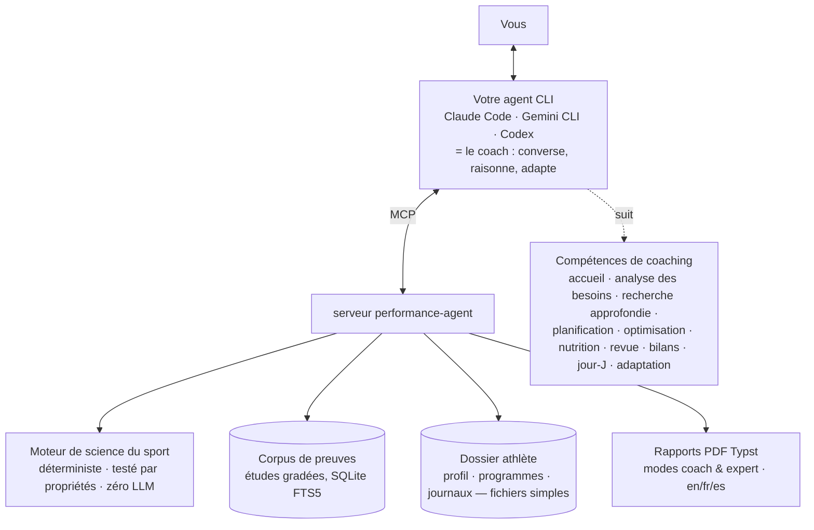

# PerformanceAgent

🏋️ **Le premier coach IA open-source de préparation physique fondé sur la recherche scientifique.**

[English](../../README.md) · **Français** · [Español](README.es.md) · [Deutsch](README.de.md) · [Italiano](README.it.md)


Il fonctionne à l'intérieur d'un agent IA en ligne de commande — un programme de
terminal avec lequel on discute, comme Claude Code, Gemini CLI ou Codex — et le
transforme en coach professionnel qui conçoit, explique, suit et adapte votre
entraînement. Pas de backend, pas de clé API, pas d'hébergement, pas d'abonnement
supplémentaire. Et il vous dit la vérité quand votre objectif est irréaliste :

```text
$ claude
> Je cours le 10 km en 55:00. Je veux 35:00 dans 12 semaines.

🏋️ Coach : J'ai évalué votre objectif avec le moteur de faisabilité :

   Probabilité : 0,2 % — je dois être honnête, c'est irréaliste.
   Vous demandez une amélioration de 36 %, soit environ 3 %/semaine
   pendant 12 semaines. Un débutant tient environ 1 %/semaine.

   Contre-proposition : 46:30 en 12 semaines (~78 % de probabilité),
   puis on réévalue. Je vous construis ce programme ?
```

## Pourquoi encore un coach IA ? Parce que celui-ci ne peut pas vous mentir

Les coachs fitness à base de LLM ont deux défauts : ils inventent des références
scientifiques, et ils vous disent ce que vous voulez entendre. PerformanceAgent est
architecturé pour que ni l'un ni l'autre ne soit possible :

- **Le LLM raconte, le moteur calcule.** Chaque nombre — probabilités de faisabilité,
  prédictions de course, charges d'entraînement, vagues de périodisation — vient d'un
  moteur Python déterministe, testé par propriétés. L'agent explique les maths ; il ne
  fait jamais les maths.
- **Les citations ne peuvent pas être hallucinées.** Le coach ne peut citer que des
  études issues du corpus local de preuves (gradées, vérifiées par DOI/PMID). Le rendu
  PDF échoue net sur toute référence hors corpus.
- **Vos données sont des fichiers, pas un cloud.** Profil, programmes, journaux de
  séances et bilans vivent dans un simple dossier de markdown/YAML que vous pouvez
  lire, éditer, comparer et synchroniser.

## Installez une fois — ensuite, un dossier par athlète

PerformanceAgent n'est pas une application à ouvrir — il se branche sur un agent IA en
ligne de commande. Vous l'installez **une seule fois** (ci-dessous) et, à partir de
là, coacher quelqu'un tient en trois gestes :

```bash
mkdir -p ~/coaching/marie && cd ~/coaching/marie && claude
```

**Créez un dossier, faites `cd` dedans, lancez `claude` — et vous coachez.** Ce dossier
*est* l'athlète : profil, programmes, journaux de séances et bilans vivent tous dedans
en fichiers simples que vous pouvez lire, modifier, versionner et sauvegarder. Rien
n'est envoyé ailleurs. Coacher plusieurs athlètes, c'est juste plusieurs dossiers —
faites `cd` dans le bon et le coach reprend là où vous en étiez. Ensuite, vous lui
parlez en langage naturel ; aucun fichier de configuration, aucune commande à mémoriser.

### Installation unique (5 minutes, 3 étapes)

**Jamais utilisé Claude Code ?** Installez-le d'abord :

```bash
curl -fsSL https://claude.ai/install.sh | bash
```

(instructions complètes : [code.claude.com/docs](https://code.claude.com/docs/en/quickstart.md)).
Il vous faut aussi [`uv`](https://docs.astral.sh/uv/getting-started/installation/) —
il récupère tout seul la bonne version de Python, rien d'autre à installer.

**Étape 1 — brancher le coach.** À lancer une seule fois, depuis n'importe quel
terminal :

```bash
claude mcp add performance-agent -s user -- uvx performance-agent
```

Cela enregistre le « cerveau » du coach (le moteur, la bibliothèque scientifique,
votre futur profil d'athlète) comme un outil que Claude Code peut appeler. `-s user`
le rend disponible depuis n'importe quel dossier où vous lancerez `claude` — c'est ce
qui fait fonctionner le principe d'un dossier par athlète.

**Étape 2 — lui apprendre à coacher.** L'étape 1 donne à Claude les *outils* (les
maths, les données). Celle-ci lui donne les *protocoles de coaching* — quoi demander
et quand, quand être honnête sur un objectif, comment construire un programme :

```bash
git clone --depth 1 https://github.com/clementrx/Performance-agent
mkdir -p ~/.claude/skills
cp -R Performance-agent/skills/* ~/.claude/skills/
```

**Étape 3 — quitter complètement et relancer Claude Code.** Un nouvel outil n'est
chargé qu'au *démarrage* d'une session `claude` : fermez toute session ouverte et
relancez `claude`.

**Vérifiez que ça marche** — ouvrez un dossier d'athlète et demandez :

```
> Liste les outils performance-agent.
```

Vous devez voir 102 outils. Si oui, c'est terminé — créez un dossier et commencez à
coacher.

> **Sur un hôte qui ne peut pas choisir le dossier de lancement ?** Claude Desktop et
> quelques autres hôtes MCP démarrent toujours au même endroit. Là, définissez
> `PERFORMANCE_AGENT_HOME` vers le dossier de l'athlète dans la config du serveur au
> lieu de faire `cd` dedans.

## Comment l'utiliser, pas à pas

1. **Placez-vous (`cd`) dans le dossier de l'athlète et lancez votre agent**
   (`claude`) — un dossier vide pour un nouvel athlète, un dossier existant pour
   reprendre son historique.
2. **Énoncez votre objectif en langage naturel** — dans la langue de votre choix.
   *« Je veux courir le 10 km en moins de 50 minutes »*.
3. **Répondez aux questions du coach.** La première fois, il déroule un court
   entretien d'accueil (niveau actuel, historique, emploi du temps, matériel) et
   enregistre votre profil.
4. **Recevez un verdict honnête.** Le moteur de faisabilité note votre objectif ; s'il
   est hors de portée, vous obtenez la vraie probabilité et une contre-proposition.
5. **Dites oui** — le programme est écrit dans `programs/program-20260712.md`,
   périodisé en cycles avec décharges et affûtage, chaque prescription portant son
   but, son grade de preuve (★★★★★ → ★☆☆☆☆) et des citations vérifiées. À côté,
   `program-20260712.html` est une page de séance autonome pour la salle : chaque
   exercice de musculation avec son GIF animé, la technique pas à pas dans votre
   langue, séries, répétitions, charge et repos — entièrement hors-ligne,
   envoyez-la sur votre téléphone. (Médias issus
   d'[exercises-dataset](https://github.com/hasaneyldrm/exercises-dataset),
   cloné automatiquement en arrière-plan au démarrage du serveur.)
6. **Après chaque séance, une ligne suffit** — *« Séance : 8 km facile, RPE 4 »*.
7. **Toutes les deux semaines environ, dites « Bilan »** — le coach compare le plan à
   la réalité, cite votre charge d'entraînement et signale les dérives.
8. **Quand la vie s'en mêle** — *« Je me suis tordu la cheville »*, *« Je ne peux
   m'entraîner que deux fois la semaine prochaine »* — le programme est adapté et
   versionné (nouveau fichier daté), la raison consignée dans le journal d'audit.

## Trois exemples concrets

Les chiffres de faisabilité ci-dessous sortent du moteur déterministe — lancez-le
vous-même, vous obtiendrez les mêmes. Envie de voir les programmes qui en résultent ?
Chacune de ces trois conversations se termine par un programme complet — parcourez-les
dans [`examples/`](../../examples/), dans les cinq langues.

### 1. Courir le 10 km en moins de 50 minutes

```text
> Je veux courir le 10 km en moins de 50 minutes. J'ai 5 mois. Coache-moi.

🏋️ Coach : Deux faits avant de juger cet objectif : votre chrono actuel
   sur 10 km, et depuis combien de temps vous vous entraînez régulièrement ?

> J'ai couru 55:12 le mois dernier. Environ un an de course, 3 fois par semaine.

🏋️ Coach : Faisabilité sur votre horizon de 21 semaines :

   Probabilité : 84 % — réaliste, et ça vaut le coup de s'engager.
   Il vous faut 9,5 % d'amélioration, soit 0,45 %/semaine, alors qu'un
   coureur de votre expérience tient environ 1 %/semaine. Marge confortable.

   Je construis le programme ?

> Oui.

📄 Programme écrit dans programs/program-20260712.md
   21 semaines, 3 sorties/semaine : une séance d'intervalles, un tempo,
   une sortie longue — périodisé avec décharges et affûtage de 10 jours.
```

### 2. Préparer un Hyrox dans 3 mois

```text
> Je me suis inscrit à un Hyrox dans 3 mois. Fais-moi un plan.

🏋️ Coach : Le Hyrox, c'est 8 km de course entrecoupés de 8 ateliers de
   force — on entraîne donc les deux, ensemble. Trois faits : votre chrono
   sur 10 km (ou une estimation), votre passé en musculation, et combien
   de jours par semaine vous pouvez vous entraîner ?

> 10 km autour de 52 min, je soulève deux fois par semaine, je peux faire 4 séances.

🏋️ Coach : Bonne base pour une belle première participation. Note honnête :
   12 semaines suffisent pour finir solidement et y prendre du plaisir ;
   viser un chrono de podium demanderait plus de temps — je préfère vous
   le dire maintenant.

   Plan sur 4 jours : un jour d'intervalles en course, un jour de force
   spécifique ateliers (sled, fentes, wall balls), un enchaînement en
   « course dégradée » (courir → atelier → courir, la compétence que le
   Hyrox teste vraiment), une sortie longue facile. Décharges semaines 4
   et 8, affûtage la semaine de course. Je le construis ?

> Oui.

📄 Programme écrit dans programs/program-20260712.md
```

### 3. Des abdos dessinés et des gros bras en 3 mois

```text
> Je veux des abdos dessinés et des gros bras en 3 mois.

🏋️ Coach : Ce sont deux objectifs physiologiques différents — les bras
   grossissent avec du volume et assez de calories ; les abdos se voient
   à un taux de gras bas, ce qui demande en général un déficit. Avant de
   promettre quoi que ce soit : taille, poids, expérience en musculation,
   et séances par semaine ?

> 1,78 m, 82 kg, deux ans de musculation, 4 séances par semaine.

🏋️ Coach : Verdict honnête : en 12 semaines vous pouvez progresser
   réellement sur les deux, mais pas maximiser les deux — la recomposition
   corporelle est lente après deux ans d'entraînement. La version réaliste :

   - Déficit calorique modéré avec un objectif de protéines élevé
     (la compétence Nutritionniste le quantifie, avec des garde-fous).
   - Priorité au haut du corps : 12 à 16 séries dures/semaine pour les
     bras, en gardant du travail lourd polyarticulaire pour protéger la
     force pendant le déficit.
   - 3 jours de musculation + 1 jour de conditioning.
   - Attendu à la semaine 12 : des bras visiblement plus pleins, des abdos
     « dessinés » si vous partez d'environ 15–18 % de masse grasse ; plus
     sec que ça prend plus de temps, et je vous le dirai à chaque bilan
     plutôt que de vous laisser deviner.

   Je vous fais le programme ?

> Oui.

📄 Programme écrit dans programs/program-20260712.md
```

## Avec quel outil IA puis-je l'utiliser ?

Le **serveur MCP** (moteur, science, données) parle un protocole standard —
[MCP](https://modelcontextprotocol.io) — que la plupart des outils IA comprennent. Les
**compétences de coaching** sont au format natif de Claude Code ; ailleurs, on colle
les mêmes instructions dans le fichier d'« instructions personnalisées » de l'outil.

| Client | Outils MCP | Compétences de coaching |
|---|---|---|
| Claude Code | ✅ natif (étapes ci-dessus) | ✅ natif |
| Gemini CLI | ✅ natif | ⚠️ à coller dans `GEMINI.md` |
| Codex | ✅ natif | ⚠️ à coller dans `AGENTS.md` |
| Cursor | ✅ natif | ⚠️ à coller dans `.cursor/rules/*.mdc` |
| Windsurf | ✅ natif | ⚠️ à coller dans ses réglages rules/memories |
| VS Code (GitHub Copilot) | ✅ natif | ⚠️ à coller dans `.github/copilot-instructions.md` |
| Cline (extension VS Code) | ✅ natif | ⚠️ à coller dans `.clinerules/` |

Commandes d'installation pour chacun, rapports PDF (nécessite `typst`), résolution du
dossier de données et dépannage : [docs/installing.md](../installing.md). Tout autre
outil qui gère les serveurs MCP fonctionne avec la même commande
`uvx performance-agent`.

## Comment ça marche

Vous êtes juste là pour le coach ? Passez cette section — elle est pour les curieux et
les contributeurs.



Les compétences encodent les protocoles d'un coach professionnel (quoi demander, quand
être honnête, comment périodiser, quand décharger). Les outils MCP détiennent chaque
fait. L'agent que vous utilisez déjà assemble le tout avec votre abonnement existant —
**zéro coût LLM supplémentaire**.

**Disponible aujourd'hui :** moteur déterministe (estimation de 1RM, prédiction de
course de Riegel, charge session-RPE & ACWR, monotonie/contrainte, forme-fatigue
CTL/ATL/TSB, classement de readiness, budgétisation de charge externe, faisabilité
d'objectif, vagues de périodisation, planification de saison à rebours depuis un
calendrier daté, autorégulation de séance le jour même (ajustement selon la readiness,
compression du temps, substitution d'exercices), séquençage intra-semaine & garde-fou
d'interférence (espacement des schémas lourds, interférence HIIT-avant-bas-du-corps,
règles de jours-forts consécutifs et de fenêtre de match), recalibrage individualisé à
partir des journaux de l'athlète (taux de progression mesuré honnête sur n, conformité
prescrit-vs-réalisé, association tolérance-volume, profil de réponse versionné) qui
recalcule la faisabilité de l'objectif face au taux mesuré, recommandations de décharge
fondées sur les données (monotonie/contrainte, tendances TSB et readiness face au
compteur planifié) et rampe progressive de retour à la charge après une coupure
(conditionnée à un feu vert), suivi proactif qui fait remonter ce qui est dû (bilan en
retard, course imminente, séances manquées, écarts de readiness, profil de réponse
périmé) trié par sévérité pour que le coach parle en premier, et une simulation
déterministe de bout en bout (sans LLM) qui pilote le vrai moteur + le stockage sur des
athlètes synthétiques — dont un sport NON PRÉ-CHARGÉ (kayak sprint) dont le modèle écrit
à la main traverse toute la chaîne exactement comme un modèle pré-chargé, prouvant que
la machine est indépendante du sport — pour prouver que toute la boucle s'assemble, un
PerformanceModel agnostique au sport (la réponse recherchée et versionnée à « qu'est-ce
qui détermine la performance dans cette épreuve » — qualités entraînables à poids
normalisés, KPI avec repères par niveau, risques de blessure et répartition des filières
énergétiques, chaque valeur étiquetée par provenance : citée/a priori/jugement) qui
pilote l'analyse des écarts (KPI mesurés vs repères, priorités d'entraînement par
qualité, le non-mesuré reste non-mesuré) et une batterie de tests datée planifiée comme
des expériences autour du calendrier, initialisée avec quatre modèles de référence
(sprint, 10 km, powerlifting, football) qui sont des exemples et non un prérequis, et une
ontologie d'exercices structurée (~120 exercices de base attribués par schéma moteur,
vecteur de force, régime de contraction, chaîne cinétique, matériel, niveau de
spécificité et qualités entraînées — filtrables et extensibles avec les ajouts de
l'athlète) avec sélection d'exercices scorée déterministe (correspondance de qualité ×
spécificité adaptée à la phase × faisabilité matériel × verrou de contre-indication ×
nouveauté, classée avec une justification par attribut), substitution à équivalence de
stimulus et garde-fou de mix de spécificité sur le mésocycle, plus une ingestion
optionnelle de données haute résolution (imports CSV d'entraînement basé sur la vitesse
en séries structurées, sorties .fit/.tcx donnant puissance/puissance normalisée/cadence/
splits, et mesures de saut/sprint versées au journal des KPI — chaque entrée haute
résolution optionnelle, une donnée manquante abaisse la résolution annoncée plutôt que
de bloquer), profilage charge-vitesse (une droite vitesse-charge ajustée par exercice
avec un 1RM estimé, contrôlée honnêtement et refusée quand les charges sont trop peu
nombreuses ou trop resserrées) qui alimente des suggestions de charge basées sur la
vitesse le jour même (bornées, étiquetées, jamais appliquées automatiquement), et un
modèle de réponse impulsionnelle de Banister à deux composantes ajusté par athlète
(ajustement par grille en pur Python des constantes de temps forme/fatigue et des gains,
contrôlé honnêtement — refusé sans ≥8 semaines de charge et ≥5 points de performance
étalés, ou en cas de valeurs bloquées/invraisemblables — injectant les propres constantes
de temps de l'athlète dans la tendance forme-fatigue), réponse individuelle à l'affûtage
(détecte les affûtages passés dans le journal de charge, apparie chacun à son résultat
lié à un événement, et recommande durée/réduction depuis le meilleur affûtage de
l'athlète quand il y en a ≥2 — sinon la règle de population étiquetée) et taux de
progression par qualité indexés sur les KPI du modèle, plus une planification de
macrocycle pluriannuelle (un plan de 1 à 4 ans typé à rebours depuis l'événement majeur
avec des budgets d'emphase par qualité et par an dérivés des priorités d'écart, alimentant
la saison) et un garde-fou de résidus d'entraînement (avertit là où une qualité maintenue
déclinerait au-delà de sa fenêtre de rétention d'Issurin sans rappel) ; 1397 tests dont
des tests par propriétés) · 102 outils MCP · mémoire athlète en fichiers avec calendrier
de saison, journaux de readiness avant séance, programmes versionnés lisibles par machine
(plan structuré + markdown rendu), journal d'ajustements du jour avec signaux
d'escalade, profil de réponse individuel versionné, modèles de performance versionnés,
journal de résultats de KPI daté et journal d'audit des adaptations · import de fichiers
d'activité (.fit/.tcx/.gpx/CSV, incl. puissance/cadence/splits et exports VBT) qui
propose une séance à confirmer par l'athlète avant journalisation · corpus de preuves
vérifiées par DOI/PMID/ISBN avec contrôle anti-fabrication des citations · recherche
bibliographique en direct (PubMed, OpenAlex, Crossref, Semantic Scholar) derrière une
double vérification · quinze compétences de coaching dont un portail de livraison
obligatoire avec contre-expertise adversariale · rapports PDF Typst (en/fr/es) derrière
un verrou strict de citations.

**Feuille de route :** environnement & affinage du pic de forme (altitude/hypoxie,
acclimatation à la chaleur, protocoles de décalage horaire, planification selon l'heure
de compétition) — la prochaine itération assumée · corpus étendu vers ~200 études ·
simulation de résultats (Monte Carlo sur le modèle de Banister ajusté) · front-end web
optionnel réutilisant le même serveur MCP.

## Principes de conception

- **La preuve d'abord** — revues systématiques → méta-analyses → ECR → cohortes → avis
  d'experts ; chaque recommandation affiche son grade, et une preuve mince est
  étiquetée comme telle.
- **Honnête par construction** — les objectifs irréalistes reçoivent des probabilités
  honnêtes avec leurs déterminants ; les métriques contestées portent leurs réserves.
- **Agent-natif** — votre agent CLI est l'interface ; votre abonnement est le calcul ;
  votre système de fichiers est la base de données.
- **Mémoire d'athlète au long cours** — aucune conversation ne repart de zéro.

## Pour les développeurs

Le moteur est un paquet Python pur, utilisable directement :

```python
from performance_agent.engine import TrainingAge, endurance_feasibility

verdict = endurance_feasibility(
    current_time_s=3300, target_time_s=2100, weeks=12, training_age=TrainingAge.BEGINNER
)
verdict.probability  # 0.0023 — avec improvement_needed, taux requis et atteignable
```

Organisation du dépôt : `src/performance_agent` (moteur, preuves, mémoire, rapports,
serveur MCP) · `skills/` (protocoles de coaching) · `docs/` (installation & usage) ·
`examples/` (conversations complètes dans cinq langues).

## Contribuer

Développement précoce, ça avance vite — voir [CONTRIBUTING.md](../../CONTRIBUTING.md)
pour la mise en place et les conventions de revue. Scientifiques du sport et
préparateurs physiques : le pipeline de gradation des preuves aura besoin de
relecteurs experts.

## Licence

Apache-2.0 — voir [LICENSE](../../LICENSE).
