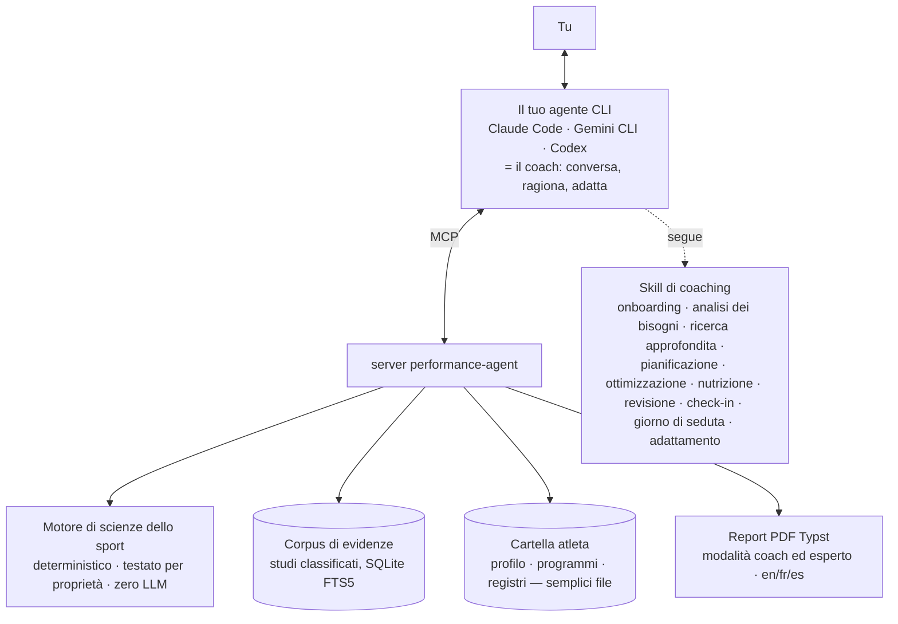

# PerformanceAgent

🏋️ **Il primo coach IA open-source di forza e condizionamento basato sulla ricerca scientifica.**

[English](../../README.md) · [Français](README.fr.md) · [Español](README.es.md) · [Deutsch](README.de.md) · **Italiano**


Funziona dentro un agente IA a riga di comando — un programma da terminale con cui si
chatta, come Claude Code, Gemini CLI o Codex — e lo trasforma in un allenatore
professionista che progetta, spiega, monitora e adatta il tuo allenamento. Nessun
backend, nessuna chiave API, nessun hosting, nessun abbonamento in più. E ti dice la
verità quando il tuo obiettivo è irrealistico:

```text
$ claude
> Corro i 10 km in 55:00. Voglio 35:00 in 12 settimane.

🏋️ Coach: Ho valutato il tuo obiettivo con il motore di fattibilità:

   Probabilità: 0,2 % — devo essere onesto, è irrealistico.
   Chiedi un miglioramento del 36 %, circa il 3 %/settimana per
   12 settimane. Un principiante sostiene circa l'1 %/settimana.

   Controproposta: 46:30 in 12 settimane (~78 % di probabilità),
   poi rivalutiamo. Vuoi che costruisca quel programma?
```

## Perché un altro coach IA? Perché questo non può mentirti

I coach fitness basati su LLM falliscono in due modi: inventano riferimenti
scientifici e ti dicono quello che vuoi sentire. PerformanceAgent è architettato
perché nessuna delle due cose sia possibile:

- **L'LLM racconta, il motore calcola.** Ogni numero — probabilità di fattibilità,
  previsioni di gara, carichi di allenamento, onde di periodizzazione — proviene da un
  motore Python deterministico, testato per proprietà. L'agente spiega la matematica;
  non la fa mai.
- **Le citazioni non si possono allucinare.** Il coach può citare solo studi
  restituiti dal corpus locale di evidenze (classificati, verificati via DOI/PMID). Il
  renderer PDF fallisce subito su qualsiasi riferimento fuori dal corpus.
- **I tuoi dati sono file, non un cloud.** Profilo, programmi, registri delle sedute e
  check-in vivono in una semplice cartella di markdown/YAML che puoi leggere,
  modificare, confrontare e sincronizzare.

## Installa una volta — poi è una cartella per atleta

PerformanceAgent non è un'app da aprire — si collega a un agente IA a riga di comando.
Lo installi **una sola volta** (sotto) e, da lì in poi, allenare qualcuno sono tre
gesti:

```bash
mkdir -p ~/coaching/marie && cd ~/coaching/marie && claude
```

**Crea una cartella, fai `cd` dentro, avvia `claude` — e stai allenando.** Quella
cartella *è* l'atleta: profilo, programmi, registri delle sessioni e check-in vivono
tutti lì dentro come semplici file che puoi leggere, modificare, versionare e salvare.
Nulla viene inviato altrove. Allenare più atleti significa solo più cartelle — fai `cd`
in quella giusta e il coach riprende da dove avevi lasciato. Poi gli parli in
linguaggio naturale; nessun file di configurazione, nessun comando da memorizzare.

### Installazione una tantum (Claude Code — 2 comandi)

**Mai usato Claude Code?** Installalo prima:

```bash
curl -fsSL https://claude.ai/install.sh | bash
```

(istruzioni complete: [code.claude.com/docs](https://code.claude.com/docs/en/quickstart.md)).
Ti serve anche [`uv`](https://docs.astral.sh/uv/getting-started/installation/) —
scarica da solo la versione giusta di Python, nient'altro da installare.

**Installa il plugin.** Da Claude Code, esegui questi due comandi una sola volta:

```
/plugin marketplace add clementrx/Performance-agent
/plugin install performance-agent@performance-agent
```

Una sola installazione ti dà entrambe le metà del coach: gli *strumenti* (il motore, la
biblioteca scientifica, il tuo futuro profilo atleta) come server MCP **e** i *protocolli
di coaching* — i 16 skill che dicono a Claude cosa chiedere e quando, quando essere onesto
su un obiettivo, come costruire un programma. Il server MCP si registra a livello utente,
quindi è disponibile da qualsiasi cartella da cui avvierai `claude` — ed è ciò che fa
funzionare una cartella per atleta. Claude Code tiene il plugin aggiornato
(`/plugin marketplace update performance-agent`).

**Chiudi completamente Claude Code e riaprilo.** I nuovi strumenti e skill vengono
caricati solo all'*avvio* di una sessione `claude`: chiudi ogni sessione aperta ed esegui
di nuovo `claude`.

**Verifica che abbia funzionato** — apri una cartella di atleta e chiedi:

```
> Elenca gli strumenti di performance-agent.
```

Dovresti vedere 103 strumenti. Se sì, hai finito — crea una cartella e comincia ad
allenare.

> **Non su Claude Code?** Cursor, Claude Desktop e altri host MCP non hanno un formato di
> plugin. Registra il server a mano con `claude mcp add performance-agent -s user -- uvx
> performance-agent` (o il JSON equivalente nella configurazione MCP del tuo host), poi
> copia i protocolli di coaching nelle istruzioni del tuo host. Passi completi per client:
> [docs/installing.md](../installing.md).

> **Su un host che non può scegliere la cartella di avvio?** Claude Desktop e qualche
> altro host MCP partono sempre dallo stesso posto. Lì, imposta `PERFORMANCE_AGENT_HOME`
> sulla cartella dell'atleta nella configurazione del server invece di fare `cd`.

## Come usarlo, passo dopo passo

1. **Fai `cd` nella cartella dell'atleta e avvia il tuo agente** (`claude`) — una
   cartella vuota per un nuovo atleta, una esistente per riprendere la sua storia.
2. **Dichiara il tuo obiettivo in linguaggio naturale** — qualsiasi lingua va bene.
   *«Voglio correre i 10 km sotto i 50 minuti»*.
3. **Rispondi alle domande del coach.** La prima volta esegue un breve colloquio
   iniziale (livello attuale, storico, orari, attrezzatura) e salva il tuo profilo.
4. **Ricevi un verdetto onesto.** Il motore di fattibilità valuta il tuo obiettivo; se
   è fuori portata, ottieni la probabilità reale e una controproposta.
5. **Di' di sì** — il programma viene scritto in `programs/program-20260712.md`,
   periodizzato in cicli con scarichi e tapering, e ogni prescrizione porta il suo
   scopo, il grado di evidenza (★★★★★ → ★☆☆☆☆) e citazioni verificate. Accanto,
   `program-20260712.html` è una pagina di seduta autonoma per la palestra: ogni
   esercizio di forza con la sua GIF animata, la tecnica passo per passo,
   serie, ripetizioni, carico e recupero — completamente offline, inviala
   al telefono. (Media da
   [exercises-dataset](https://github.com/hasaneyldrm/exercises-dataset),
   clonato automaticamente in background all'avvio del server.)
6. **Dopo ogni allenamento, registralo in una riga** — *«Registrato: 8 km facili, RPE 4»*.
7. **Ogni due settimane circa, di' «Check-in»** — il coach confronta il piano con la
   realtà, cita il tuo carico di allenamento e segnala le derive.
8. **Quando la vita si mette di mezzo** — *«Mi sono storto la caviglia»*, *«La
   prossima settimana posso allenarmi solo due volte»* — il programma viene adattato e
   versionato (nouveau fichier daté), con il motivo registrato nel registro di audit.

## Tre esempi reali

I numeri di fattibilità qui sotto escono dal motore deterministico — eseguilo tu
stesso e otterrai gli stessi. Vuoi vedere i programmi che ne risultano? Ognuna di
queste tre conversazioni termina con un programma completo — sfogliali in
[`examples/`](../../examples/), in tutte e cinque le lingue.

### 1. Correre i 10 km sotto i 50 minuti

```text
> Voglio correre i 10 km sotto i 50 minuti. Ho 5 mesi. Allenami.

🏋️ Coach: Due fatti prima di giudicare quell'obiettivo: il tuo tempo
   attuale sui 10 km, e da quanto ti alleni con costanza?

> Ho corso 55:12 il mese scorso. Circa un anno di corsa, 3 volte a settimana.

🏋️ Coach: Fattibilità sul tuo orizzonte di 21 settimane:

   Probabilità: 84 % — realistico, e vale l'impegno.
   Ti serve un miglioramento del 9,5 %, cioè lo 0,45 %/settimana,
   mentre un corridore con la tua esperienza sostiene circa
   l'1 %/settimana. Margine comodo.

   Costruisco il programma?

> Sì.

📄 Programma scritto in programs/program-20260712.md
   21 settimane, 3 corse/settimana: una seduta di ripetute, un tempo
   run, un lungo — periodizzato con scarichi e tapering di 10 giorni.
```

### 2. Preparare una Hyrox in 3 mesi

```text
> Mi sono iscritto a una Hyrox tra 3 mesi. Fammi un piano.

🏋️ Coach: La Hyrox sono 8 km di corsa interrotti da 8 stazioni di
   forza — quindi alleniamo entrambe, insieme. Tre fatti: il tuo tempo
   sui 10 km (o una stima), il tuo passato con i pesi, e quanti giorni
   a settimana puoi allenarti?

> 10 km intorno a 52 min, faccio pesi due volte a settimana, posso fare 4 sedute.

🏋️ Coach: Buona base per un primo arrivo solido. Nota onesta: 12
   settimane bastano per finire bene e godersela; puntare a un tempo da
   podio richiederebbe più tempo — preferisco dirtelo adesso.

   Piano su 4 giorni: un giorno di ripetute di corsa, un giorno di
   forza sulle stazioni (sled, affondi, wall ball), un blocco di
   «corsa compromessa» (corri → stazione → corri, la capacità che la
   Hyrox mette davvero alla prova), un lungo facile. Scarichi alle
   settimane 4 e 8, tapering nella settimana di gara. Lo costruisco?

> Sì.

📄 Programma scritto in programs/program-20260712.md
```

### 3. Addominali scolpiti e braccia grosse in 3 mesi

```text
> Voglio addominali scolpiti e braccia più grosse in 3 mesi.

🏋️ Coach: Sono due obiettivi fisiologici diversi — le braccia crescono
   con volume e calorie sufficienti; gli addominali si vedono con una
   percentuale di grasso bassa, il che di solito richiede un deficit.
   Prima di promettere qualsiasi cosa: altezza, peso, esperienza di
   allenamento e sedute a settimana?

> 1,78 m, 82 kg, due anni di pesi, 4 sedute a settimana.

🏋️ Coach: Verdetto onesto: in 12 settimane puoi fare progressi veri su
   entrambi, ma non massimizzare entrambi — la ricomposizione corporea è
   lenta con due anni di esperienza. La versione realistica:

   - Deficit calorico moderato con un obiettivo proteico alto (la
     skill Nutrizionista lo quantifica, con tutele di sicurezza).
   - Priorità alla parte superiore: 12–16 serie dure/settimana per le
     braccia, mantenendo lavoro pesante multiarticolare per proteggere
     la forza durante il deficit.
   - 3 giorni di pesi + 1 giorno di conditioning.
   - Atteso alla settimana 12: braccia visibilmente più piene,
     addominali «delineati» se parti da circa il 15–18 % di grasso
     corporeo; più definizione richiede più tempo, e te lo dirò a ogni
     check-in invece di lasciarti indovinare.

   Vuoi il programma?

> Sì.

📄 Programma scritto in programs/program-20260712.md
```

## Con quale strumento IA posso usarlo?

Il **server MCP** (motore, scienza, dati) parla un protocollo standard —
[MCP](https://modelcontextprotocol.io) — che la maggior parte degli strumenti IA
capisce. Le **skill di coaching** sono nel formato nativo di Claude Code; altrove
incolli le stesse istruzioni nel file di «istruzioni personalizzate» dello strumento.

| Client | Strumenti MCP | Skill di coaching |
|---|---|---|
| Claude Code | ✅ nativo (passi sopra) | ✅ nativo |
| Gemini CLI | ✅ nativo | ⚠️ incollare in `GEMINI.md` |
| Codex | ✅ nativo | ⚠️ incollare in `AGENTS.md` |
| Cursor | ✅ nativo | ⚠️ incollare in `.cursor/rules/*.mdc` |
| Windsurf | ✅ nativo | ⚠️ incollare nelle sue impostazioni rules/memories |
| VS Code (GitHub Copilot) | ✅ nativo | ⚠️ incollare in `.github/copilot-instructions.md` |
| Cline (estensione VS Code) | ✅ nativo | ⚠️ incollare in `.clinerules/` |

Comandi di installazione per ciascuno, report PDF (richiede `typst`), risoluzione
della cartella dati e risoluzione dei problemi: [docs/installing.md](../installing.md).
Qualsiasi altro strumento che supporti i server MCP funziona con lo stesso comando
`uvx performance-agent`.

## Come funziona

Sei qui solo per il coach? Salta questa sezione — è per i curiosi e per chi
contribuisce.



Le skill codificano i protocolli di un allenatore professionista (cosa chiedere,
quando essere onesto, come periodizzare, quando scaricare). Gli strumenti MCP
possiedono ogni fatto. L'agente che già usi mette tutto insieme con il tuo abbonamento
esistente — **zero costi LLM aggiuntivi**.

**Disponibile oggi:** motore deterministico (stima dell'1RM, previsione di gara di
Riegel, carico session-RPE e ACWR, monotonia/strain, forma-fatica CTL/ATL/TSB,
classificazione della readiness, budget del carico esterno, fattibilità degli
obiettivi, onde di periodizzazione, pianificazione della stagione a ritroso da un
calendario con date, autoregolazione della seduta in giornata (aggiustamento in base
alla readiness, compressione del tempo, sostituzione degli esercizi), sequenziamento
intra-settimana e guardia sulle interferenze (spaziatura dei pattern pesanti,
interferenza HIIT-prima-del-treno-inferiore, regole di giorni forti consecutivi e di
finestra di match), ricalibrazione individualizzata dai log dell'atleta (tasso di
progressione misurato onesto su n, conformità prescritto-vs-reale, associazione
tolleranza-volume, profilo di risposta versionato) che ricalcola la fattibilità
dell'obiettivo rispetto al tasso misurato, raccomandazioni di scarico basate sui dati
(monotonia/strain, tendenze di TSB e readiness rispetto al contatore pianificato) e
rampa progressiva di ritorno al carico dopo una pausa (subordinata a un via libera),
follow-up proattivo che fa emergere ciò che è dovuto (check-in in ritardo, gara
imminente, sedute saltate, lacune di readiness, profilo di risposta scaduto) ordinato
per gravità perché il coach parli per primo, e una simulazione deterministica
end-to-end (senza LLM) che pilota il motore reale + l'archivio su atleti sintetici —
incluso uno sport NON PRECARICATO (kayak sprint) il cui modello scritto a mano
attraversa l'intera catena esattamente come uno precaricato, dimostrando che la
macchina è indipendente dallo sport — per dimostrare che l'intero ciclo si compone, un
PerformanceModel agnostico allo sport (la risposta ricercata e versionata a «cosa
determina la prestazione in questa prova» — qualità allenabili con pesi normalizzati,
KPI con benchmark per livello, rischi di infortunio e ripartizione dei sistemi
energetici, ogni valore etichettato per provenienza: citato/a priori/giudizio) che
pilota l'analisi delle lacune (KPI misurati vs benchmark, priorità di allenamento per
qualità, il non misurato resta non misurato) e una batteria di test con date
pianificata come esperimenti attorno al calendario, inizializzata con quattro modelli
di riferimento (sprint, 10 km, powerlifting, calcio) che sono esempi e non un
prerequisito, e un'ontologia degli esercizi strutturata (~120 esercizi di base
attribuiti per pattern di movimento, vettore di forza, regime di contrazione, catena
cinetica, attrezzatura, livello di specificità e qualità allenate — filtrabili ed
estensibili con le aggiunte dell'atleta) con selezione degli esercizi punteggiata
deterministica (corrispondenza di qualità × specificità appropriata alla fase ×
fattibilità attrezzatura × blocco per controindicazione × novità, classificata con una
giustificazione per attributo), sostituzione a equivalenza di stimolo e guardia sul mix
di specificità del mesociclo, oltre a un'ingestione opzionale di dati ad alta
risoluzione (importazioni CSV di allenamento basato sulla velocità come serie
strutturate, uscite .fit/.tcx che danno potenza/potenza normalizzata/cadenza/parziali,
e misurazioni di salto/sprint che finiscono nel log dei KPI — ogni input ad alta
risoluzione opzionale, un dato mancante abbassa la risoluzione dichiarata invece di
bloccare), profilazione carico-velocità (una retta velocità-carico adattata per
esercizio con un 1RM stimato, controllata onestamente e rifiutata quando i carichi sono
troppo pochi o troppo ristretti) che alimenta suggerimenti di carico basati sulla
velocità in giornata (limitati, etichettati, mai applicati automaticamente), e un
modello di risposta all'impulso di Banister a due componenti adattato per atleta (fit a
griglia in puro Python delle costanti di tempo forma/fatica e dei guadagni, controllato
onestamente — rifiutato senza ≥8 settimane di carico e ≥5 punti di prestazione
distribuiti, o con valori fissati/inverosimili — che immette le costanti di tempo
dell'atleta stesso nella tendenza forma-fatica), risposta individuale al tapering
(rileva i tapering passati nel log del carico, abbina ciascuno al suo risultato legato
a un evento, e raccomanda durata/riduzione dal miglior tapering dell'atleta stesso
quando ce ne sono ≥2 — altrimenti la regola di popolazione etichettata) e tassi di
progressione per qualità indicizzati sui KPI del modello, oltre alla pianificazione di
macrociclo pluriennale (un piano da 1 a 4 anni tipizzato a ritroso dall'evento
principale con budget di enfasi per qualità e per anno derivati dalle priorità delle
lacune, che alimentano la stagione) e una guardia sui residui di allenamento (avverte
dove una qualità mantenuta decadrebbe oltre la sua finestra di ritenzione di Issurin
senza un richiamo); 1425 test incl. property-based) · 103 strumenti MCP · memoria
atleta su file con calendario di stagione, log di readiness pre-seduta, programmi
versionati leggibili dalla macchina (piano strutturato + markdown renderizzato),
registro degli aggiustamenti in giornata con segnali di escalation, profilo di risposta
individuale versionato, modelli di prestazione versionati, log dei risultati KPI con
date e registro di audit degli adattamenti · import di file di attività
(.fit/.tcx/.gpx/CSV, incl. potenza/cadenza/parziali ed export VBT) che propone una
seduta da confermare dall'atleta prima di registrarla — o recuperate
direttamente da Garmin/Strava quando il loro server MCP è connesso ·
tendenze di recupero lette in modo deterministico (ln-rMSSD mobile vs
baseline di 28 giorni ± il minimo cambiamento rilevante, FC a riposo e debito
di sonno, con guardrail di onestà) da una skill dedicata recovery-analyst · corpus di evidenze verificate
via DOI/PMID/ISBN con controllo anti-fabbricazione delle citazioni · ricerca di
evidenze in tempo reale (PubMed, OpenAlex, Crossref, Semantic Scholar) dietro doppia
verifica · sedici skill di coaching incl. un gate di consegna obbligatorio con
seconda opinione avversariale · report PDF Typst (en/fr/es) dietro un blocco rigido
delle citazioni.

**Roadmap:** ambiente e affinamento del picco di forma (altitudine/ipossia,
acclimatazione al caldo, protocolli di jet-lag, pianificazione secondo l'ora di gara) —
la prossima iterazione deliberata · crescita del corpus verso ~200 studi · simulazione
dei risultati (Monte Carlo sul modello di Banister adattato) · front-end web opzionale
che riusa lo stesso server MCP.

## Principi di progettazione

- **Prima l'evidenza** — revisioni sistematiche → meta-analisi → RCT → coorti →
  opinione di esperti; ogni raccomandazione mostra il suo grado, e l'evidenza debole è
  etichettata come tale.
- **Onesto per costruzione** — gli obiettivi irrealistici ricevono probabilità oneste
  con i loro determinanti; le metriche contestate portano le loro riserve.
- **Nativo per agenti** — il tuo agente CLI è l'interfaccia; il tuo abbonamento è il
  calcolo; il tuo filesystem è il database.
- **Memoria dell'atleta a lungo termine** — nessuna conversazione riparte da zero.

## Per gli sviluppatori

Il motore è un pacchetto Python puro utilizzabile direttamente:

```python
from performance_agent.engine import TrainingAge, endurance_feasibility

verdict = endurance_feasibility(
    current_time_s=3300, target_time_s=2100, weeks=12, training_age=TrainingAge.BEGINNER
)
verdict.probability  # 0.0023 — con improvement_needed, tassi richiesto e raggiungibile
```

Struttura del repository: `src/performance_agent` (motore, evidenze, memoria, report,
server MCP) · `skills/` (protocolli di coaching) · `docs/` (installazione e uso) ·
`examples/` (conversazioni complete in cinque lingue).

## Contribuire

Sviluppo iniziale, si avanza in fretta — vedi [CONTRIBUTING.md](../../CONTRIBUTING.md)
per il setup e le convenzioni di review. Scienziati dello sport e preparatori
atletici: la pipeline di classificazione delle evidenze avrà bisogno di revisori
esperti.

## Licenza

Apache-2.0 — vedi [LICENSE](../../LICENSE).
