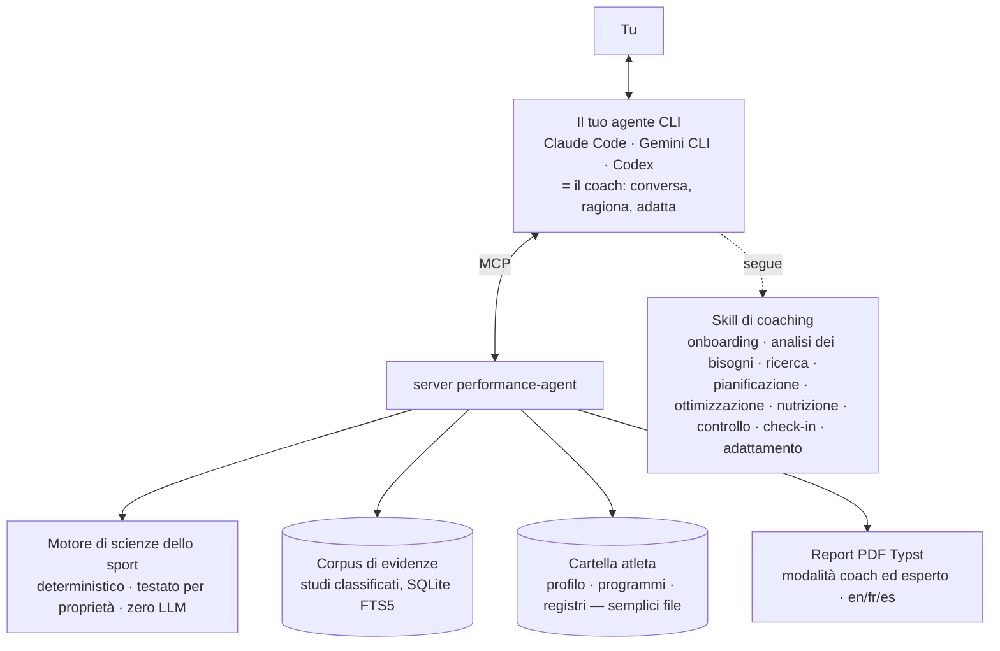

# PerformanceAgent

🏋️ **Il primo coach IA open-source di forza e condizionamento basato sulla ricerca scientifica.**

[English](../../README.md) · [Français](README.fr.md) · [Español](README.es.md) · [Deutsch](README.de.md) · **Italiano**


Funziona dentro un agente IA a riga di comando — un programma da terminale con cui si
chatta, come Claude Code, Gemini CLI o Codex — e lo trasforma in un allenatore
professionista che progetta, spiega, monitora e adatta il tuo allenamento. Nessun
backend, nessuna chiave API, nessun hosting, nessun abbonamento in più. E ti dice la
verità quando il tuo obiettivo è irrealistico:

```text
$ claude
> Corro i 10 km in 55:00. Voglio 35:00 in 12 settimane.

🏋️ Coach: Ho valutato il tuo obiettivo con il motore di fattibilità:

   Probabilità: 0,2 % — devo essere onesto, è irrealistico.
   Chiedi un miglioramento del 36 %, circa il 3 %/settimana per
   12 settimane. Un principiante sostiene circa l'1 %/settimana.

   Controproposta: 46:30 in 12 settimane (~78 % di probabilità),
   poi rivalutiamo. Vuoi che costruisca quel programma?
```

## Perché un altro coach IA? Perché questo non può mentirti

I coach fitness basati su LLM falliscono in due modi: inventano riferimenti
scientifici e ti dicono quello che vuoi sentire. PerformanceAgent è architettato
perché nessuna delle due cose sia possibile:

- **L'LLM racconta, il motore calcola.** Ogni numero — probabilità di fattibilità,
  previsioni di gara, carichi di allenamento, onde di periodizzazione — proviene da un
  motore Python deterministico, testato per proprietà. L'agente spiega la matematica;
  non la fa mai.
- **Le citazioni non si possono allucinare.** Il coach può citare solo studi
  restituiti dal corpus locale di evidenze (classificati, verificati via DOI/PMID). Il
  renderer PDF fallisce subito su qualsiasi riferimento fuori dal corpus.
- **I tuoi dati sono file, non un cloud.** Profilo, programmi, registri delle sedute e
  check-in vivono in una semplice cartella di markdown/YAML che puoi leggere,
  modificare, confrontare e sincronizzare.

## Installazione (5 minuti, 3 passi)

PerformanceAgent non è un'app da aprire — si collega a un agente IA a riga di comando.
Una volta collegato, gli parli semplicemente in linguaggio naturale; nessun file di
configurazione, nessun comando da memorizzare.

**Mai usato Claude Code?** Installalo prima:

```bash
curl -fsSL https://claude.ai/install.sh | bash
```

(istruzioni complete: [code.claude.com/docs](https://code.claude.com/docs/en/quickstart.md)).
Ti serve anche [`uv`](https://docs.astral.sh/uv/getting-started/installation/) —
scarica da solo la versione giusta di Python, nient'altro da installare.

**Passo 1 — collegare il coach.** Esegui questo una sola volta, da qualsiasi terminale:

```bash
claude mcp add performance-agent -s user \
  --env PERFORMANCE_AGENT_HOME=~/athlete-data -- uvx performance-agent
```

Questo registra il «cervello» del coach (il motore, la biblioteca scientifica, il tuo
futuro profilo atleta) come strumento che Claude Code può richiamare. `-s user` lo
rende disponibile in qualsiasi cartella da cui aprirai `claude`. `~/athlete-data` è
solo un suggerimento — scegli la cartella che vuoi, non serve che esista: il coach la
crea al primo salvataggio. Lì vivono tutti i tuoi dati come semplici file; nulla viene
inviato altrove.

**Passo 2 — insegnargli ad allenare.** Il passo 1 ha dato a Claude gli *strumenti* (la
matematica, i dati). Questo passo gli dà i *protocolli di coaching* — cosa chiedere e
quando, quando essere onesto su un obiettivo, come costruire un programma:

```bash
git clone --depth 1 https://github.com/clementrx/Performance-agent
mkdir -p ~/.claude/skills
cp -R Performance-agent/skills/* ~/.claude/skills/
```

**Passo 3 — chiudi completamente Claude Code e riaprilo.** Un nuovo strumento viene
caricato solo all'*avvio* di una sessione `claude`: chiudi ogni sessione aperta ed
esegui di nuovo `claude`.

**Verifica che abbia funzionato** — nella sessione nuova, chiedi:

```
> Elenca gli strumenti di performance-agent.
```

Dovresti vedere 47 strumenti. Se sì, hai finito — parlagli e basta.

## Come usarlo, passo dopo passo

1. **Apri un terminale e avvia il tuo agente** (`claude`).
2. **Dichiara il tuo obiettivo in linguaggio naturale** — qualsiasi lingua va bene.
   *«Voglio correre i 10 km sotto i 50 minuti»*.
3. **Rispondi alle domande del coach.** La prima volta esegue un breve colloquio
   iniziale (livello attuale, storico, orari, attrezzatura) e salva il tuo profilo.
4. **Ricevi un verdetto onesto.** Il motore di fattibilità valuta il tuo obiettivo; se
   è fuori portata, ottieni la probabilità reale e una controproposta.
5. **Di' di sì** — il programma viene scritto in `athlete/programs/program-v1.md`,
   periodizzato in cicli con scarichi e tapering, e ogni prescrizione porta il suo
   scopo, il grado di evidenza (★★★★★ → ★☆☆☆☆) e citazioni verificate.
6. **Dopo ogni allenamento, registralo in una riga** — *«Registrato: 8 km facili, RPE 4»*.
7. **Ogni due settimane circa, di' «Check-in»** — il coach confronta il piano con la
   realtà, cita il tuo carico di allenamento e segnala le derive.
8. **Quando la vita si mette di mezzo** — *«Mi sono storto la caviglia»*, *«La
   prossima settimana posso allenarmi solo due volte»* — il programma viene adattato e
   versionato (`program-v2.md`), con il motivo registrato nel registro di audit.

## Tre esempi reali

I numeri di fattibilità qui sotto escono dal motore deterministico — eseguilo tu
stesso e otterrai gli stessi. Vuoi vedere i programmi che ne risultano? Ognuna di
queste tre conversazioni termina con un programma completo — sfogliali in
[`examples/`](../../examples/), in tutte e cinque le lingue.

### 1. Correre i 10 km sotto i 50 minuti

```text
> Voglio correre i 10 km sotto i 50 minuti. Ho 5 mesi. Allenami.

🏋️ Coach: Due fatti prima di giudicare quell'obiettivo: il tuo tempo
   attuale sui 10 km, e da quanto ti alleni con costanza?

> Ho corso 55:12 il mese scorso. Circa un anno di corsa, 3 volte a settimana.

🏋️ Coach: Fattibilità sul tuo orizzonte di 21 settimane:

   Probabilità: 84 % — realistico, e vale l'impegno.
   Ti serve un miglioramento del 9,5 %, cioè lo 0,45 %/settimana,
   mentre un corridore con la tua esperienza sostiene circa
   l'1 %/settimana. Margine comodo.

   Costruisco il programma?

> Sì.

📄 Programma scritto in athlete/programs/program-v1.md
   21 settimane, 3 corse/settimana: una seduta di ripetute, un tempo
   run, un lungo — periodizzato con scarichi e tapering di 10 giorni.
```

### 2. Preparare una Hyrox in 3 mesi

```text
> Mi sono iscritto a una Hyrox tra 3 mesi. Fammi un piano.

🏋️ Coach: La Hyrox sono 8 km di corsa interrotti da 8 stazioni di
   forza — quindi alleniamo entrambe, insieme. Tre fatti: il tuo tempo
   sui 10 km (o una stima), il tuo passato con i pesi, e quanti giorni
   a settimana puoi allenarti?

> 10 km intorno a 52 min, faccio pesi due volte a settimana, posso fare 4 sedute.

🏋️ Coach: Buona base per un primo arrivo solido. Nota onesta: 12
   settimane bastano per finire bene e godersela; puntare a un tempo da
   podio richiederebbe più tempo — preferisco dirtelo adesso.

   Piano su 4 giorni: un giorno di ripetute di corsa, un giorno di
   forza sulle stazioni (sled, affondi, wall ball), un blocco di
   «corsa compromessa» (corri → stazione → corri, la capacità che la
   Hyrox mette davvero alla prova), un lungo facile. Scarichi alle
   settimane 4 e 8, tapering nella settimana di gara. Lo costruisco?

> Sì.

📄 Programma scritto in athlete/programs/program-v1.md
```

### 3. Addominali scolpiti e braccia grosse in 3 mesi

```text
> Voglio addominali scolpiti e braccia più grosse in 3 mesi.

🏋️ Coach: Sono due obiettivi fisiologici diversi — le braccia crescono
   con volume e calorie sufficienti; gli addominali si vedono con una
   percentuale di grasso bassa, il che di solito richiede un deficit.
   Prima di promettere qualsiasi cosa: altezza, peso, esperienza di
   allenamento e sedute a settimana?

> 1,78 m, 82 kg, due anni di pesi, 4 sedute a settimana.

🏋️ Coach: Verdetto onesto: in 12 settimane puoi fare progressi veri su
   entrambi, ma non massimizzare entrambi — la ricomposizione corporea è
   lenta con due anni di esperienza. La versione realistica:

   - Deficit calorico moderato con un obiettivo proteico alto (la
     skill Nutrizionista lo quantifica, con tutele di sicurezza).
   - Priorità alla parte superiore: 12–16 serie dure/settimana per le
     braccia, mantenendo lavoro pesante multiarticolare per proteggere
     la forza durante il deficit.
   - 3 giorni di pesi + 1 giorno di conditioning.
   - Atteso alla settimana 12: braccia visibilmente più piene,
     addominali «delineati» se parti da circa il 15–18 % di grasso
     corporeo; più definizione richiede più tempo, e te lo dirò a ogni
     check-in invece di lasciarti indovinare.

   Vuoi il programma?

> Sì.

📄 Programma scritto in athlete/programs/program-v1.md
```

## Con quale strumento IA posso usarlo?

Il **server MCP** (motore, scienza, dati) parla un protocollo standard —
[MCP](https://modelcontextprotocol.io) — che la maggior parte degli strumenti IA
capisce. Le **skill di coaching** sono nel formato nativo di Claude Code; altrove
incolli le stesse istruzioni nel file di «istruzioni personalizzate» dello strumento.

| Client | Strumenti MCP | Skill di coaching |
|---|---|---|
| Claude Code | ✅ nativo (passi sopra) | ✅ nativo |
| Gemini CLI | ✅ nativo | ⚠️ incollare in `GEMINI.md` |
| Codex | ✅ nativo | ⚠️ incollare in `AGENTS.md` |
| Cursor | ✅ nativo | ⚠️ incollare in `.cursor/rules/*.mdc` |
| Windsurf | ✅ nativo | ⚠️ incollare nelle sue impostazioni rules/memories |
| VS Code (GitHub Copilot) | ✅ nativo | ⚠️ incollare in `.github/copilot-instructions.md` |
| Cline (estensione VS Code) | ✅ nativo | ⚠️ incollare in `.clinerules/` |

Comandi di installazione per ciascuno, report PDF (richiede `typst`), risoluzione
della cartella dati e risoluzione dei problemi: [docs/installing.md](../installing.md).
Qualsiasi altro strumento che supporti i server MCP funziona con lo stesso comando
`uvx performance-agent`.

## Come funziona

Sei qui solo per il coach? Salta questa sezione — è per i curiosi e per chi
contribuisce.



Le skill codificano i protocolli di un allenatore professionista (cosa chiedere,
quando essere onesto, come periodizzare, quando scaricare). Gli strumenti MCP
possiedono ogni fatto. L'agente che già usi mette tutto insieme con il tuo abbonamento
esistente — **zero costi LLM aggiuntivi**.

**Disponibile oggi:** motore deterministico (stima dell'1RM, previsione di gara di
Riegel, carico session-RPE e ACWR, fattibilità degli obiettivi, onde di
periodizzazione; 290 test incl. property-based) · 47 strumenti MCP · memoria atleta su
file con programmi versionati e registro di audit degli adattamenti · corpus di
evidenze verificate via DOI/PMID/ISBN con controllo anti-fabbricazione delle
citazioni · ricerca di evidenze in tempo reale (PubMed, OpenAlex, Crossref, Semantic
Scholar) dietro doppia verifica · undici skill di coaching incl. un gate di consegna
obbligatorio con seconda opinione avversariale · report PDF Typst (en/fr/es) dietro un
blocco rigido delle citazioni.

**Roadmap:** crescita del corpus verso ~200 studi · simulazione dei risultati
(Banister + Monte Carlo) · nuove verticali sportive (strumenti del motore specifici
per Hyrox, calcio, tennis) · front-end web opzionale che riusa lo stesso server MCP.

## Principi di progettazione

- **Prima l'evidenza** — revisioni sistematiche → meta-analisi → RCT → coorti →
  opinione di esperti; ogni raccomandazione mostra il suo grado, e l'evidenza debole è
  etichettata come tale.
- **Onesto per costruzione** — gli obiettivi irrealistici ricevono probabilità oneste
  con i loro determinanti; le metriche contestate portano le loro riserve.
- **Nativo per agenti** — il tuo agente CLI è l'interfaccia; il tuo abbonamento è il
  calcolo; il tuo filesystem è il database.
- **Memoria dell'atleta a lungo termine** — nessuna conversazione riparte da zero.

## Per gli sviluppatori

Il motore è un pacchetto Python puro utilizzabile direttamente:

```python
from performance_agent.engine import TrainingAge, endurance_feasibility

verdict = endurance_feasibility(
    current_time_s=3300, target_time_s=2100, weeks=12, training_age=TrainingAge.BEGINNER
)
verdict.probability  # 0.0023 — con improvement_needed, tassi richiesto e raggiungibile
```

Struttura del repository: `src/performance_agent` (motore + server MCP) ·
`docs/superpowers/specs` (blueprint di architettura) · `docs/superpowers/plans`
(piani di implementazione con note as-built).

## Contribuire

Sviluppo iniziale, si avanza in fretta — vedi [CONTRIBUTING.md](../../CONTRIBUTING.md)
per il setup e le convenzioni di review. Il blueprint in `docs/superpowers/specs/` è
la fonte di verità. Scienziati dello sport e preparatori atletici: la pipeline di
classificazione delle evidenze avrà bisogno di revisori esperti.

## Licenza

Apache-2.0 — vedi [LICENSE](../../LICENSE).
